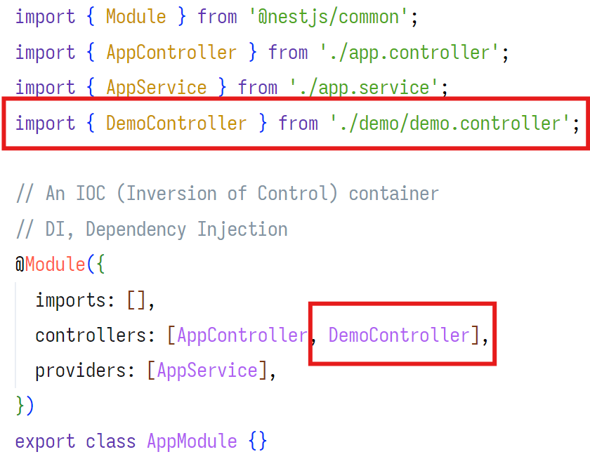

# Nest.JS

安装 nest

```bash
pnpm i -g @nestjs/cli
nest new nest-demo
```

nest 命令

```bash
nest --help
nest generate controller demo # nest g co demo
# 自动生成 ./src/demo 目录,
# 自动生成 ./src/demo/demo.controller.ts, ./src/demo/demo.controller.spec.ts 文件
# 更新 app.module.ts 文件
nest generate module demo # nest g mo demo
nest generate service demo # nest g s demo

nest generate resource user # nest g res user 自动生成增删改查
nest g res chart
nest g res robot
```

## HTTP 状态码

- 200 OK
- 304 Not Modified 协商缓存
- 400 Bad Request 参数错误
- 401 Unauthorized token 错误
- 403 Forbidden referer origin 验证失败, 防止跨站脚本攻击
- 500 Internal Server Error 服务器错误
- 502 Bad Gateway 网关错误


