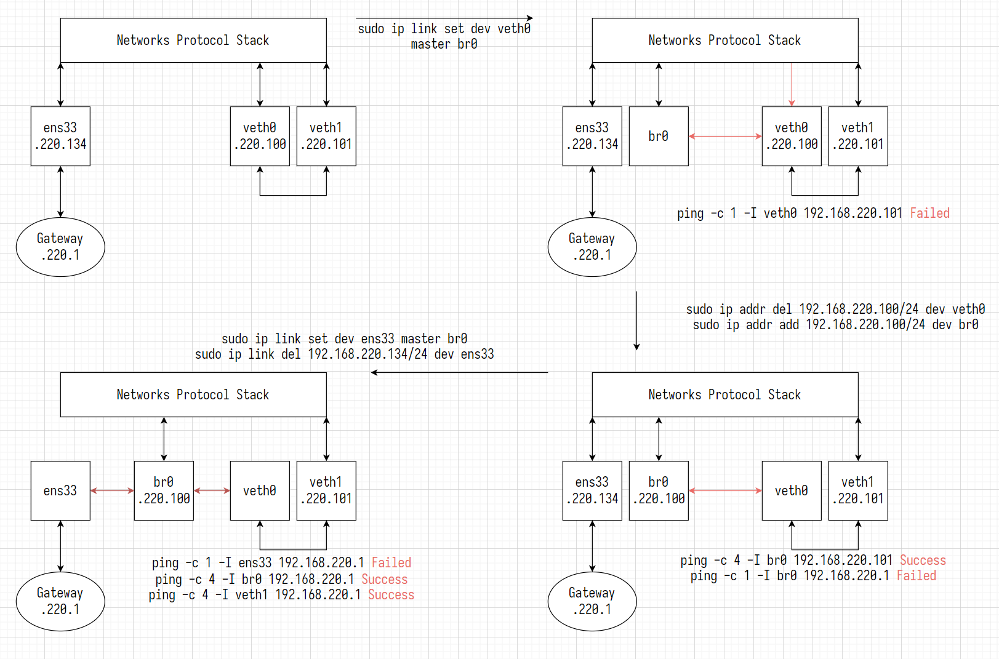

# Linux

## `~/.zshrc`

```bash
# zsh
export ZSH="$HOME/.oh-my-zsh"
ZSH_THEME="ys"
plugins=(git zsh-autosuggestions zsh-syntax-highlighting)
source "$ZSH/oh-my-zsh.sh"
export EDITOR="vim"

# user
proxy=$(ip route | grep 'default' | awk '{print $3}'):7890
export HTTP_PROXY=http://$proxy
export HTTPS_PROXY=http://$proxy
export ALL_PROXY=socks5://$proxy

# c, c++
export CC="/usr/bin/gcc"
export CXX="/usr/bin/g++"
export CMAKE_GENERATOR="Ninja"

# js, ts
export NVM_DIR="$HOME/.nvm"
[ -s "$NVM_DIR/nvm.sh" ] && \. "$NVM_DIR/nvm.sh"
[ -s "$NVM_DIR/bash_completion" ] && \. "$NVM_DIR/bash_completion"

# python3
export PATH="$HOME/venv/bin:$PATH"

# pnpm
export PNPM_HOME="$HOME/.local/share/pnpm"
case ":$PATH:" in
  *":$PNPM_HOME:"*) ;;
  *) export PATH="$PNPM_HOME:$PATH" ;;
esac
# pnpm end

. "$HOME/.deno/env"
```

## vim

```shell
# 命令模式
i|insert|a # 切换到插入模式
:          # 切换到命令行模式
x          # 删除当前字符
o          # 在下方插入行, 并切换到插入模式
O          # 在上方插入行, 并切换到插入模式
dd         # 剪切当前行
yy         # 复制当前行
P          # 光标后粘贴
p          # 光标前粘贴
u          # 撤销

# 输入模式
esc        # 切换到命令模式

# 命令行模式
:w         # 写文件
:q         # 退出
:wq        # 写文件并退出
:q!        # 强制退出
```

## Ubuntu

````shell
wsl --list [--online]
wsl --install -d Ubuntu
wsl --set-default Ubuntu
wsl --shutdown
# wsl --unregister Ubuntu

sudo apt update && sudo apt upgrade && sudo apt-get update && sudo apt-get upgrade -y
sudo apt install \
apt-transport-https \
build-essential \
ca-certificates clang clang-format clangd cmake curl \
firewalld \
gdb git \
iperf3 \
lld llvm \
net-tools ninja-build \
openssh-server \
pkg-config \
tree \
vim \
wget \
zip zsh \
--fix-missing -y

# git
git config --global user.name Tiancheng && \
git config --global user.email 'yukino161043261@gmail.com' && \
git config --global core.autocrlf false && \
git config --global credential.helper store && \
git config --global init.defaultBranch main && \
git config --global core.filemode false && \
ssh-keygen -t rsa -C 'yukino161043261@gmail.com'

# proxy
vim ~/.bashrc

proxy="127.0.0.1:7890"
export HTTP_PROXY=http://$proxy
export HTTPS_PROXY=http://$proxy
export ALL_PROXY=socks5://$proxy

source ~/.bashrc

# zsh
sh -c "$(curl -fsSL https://raw.githubusercontent.com/ohmyzsh/ohmyzsh/master/tools/install.sh)"

git clone https://github.com/zsh-users/zsh-autosuggestions.git $ZSH_CUSTOM/plugins/zsh-autosuggestions && \
git clone https://github.com/zsh-users/zsh-syntax-highlighting.git $ZSH_CUSTOM/plugins/zsh-syntax-highlighting

# python3
sudo apt install python3 python3-pip python3-venv -y
python3 -m venv ~/python3

# nvm for nodejs
curl -o- https://raw.githubusercontent.com/nvm-sh/nvm/v0.40.1/install.sh | bash
nvm ls-remote
npm install typescript -g

# pnpm
curl -fsSL https://get.pnpm.io/install.sh | sh -

# deno
curl -fsSL https://deno.land/install.sh | sh

## ssh

Secure Shell (SSH) Protocol

```shell
# client
cat ~/.ssh/id_rsa.pub | ssh user@192.168.220.140 -p 22 "cat >> ~/.ssh/authorized_keys" && ssh user@192.168.220.140 -p 22

# vim ~/.ssh/config
Host vm
  HostName 192.168.220.140
  User user
````

## .wslconfig

vim /mnt/c/Users/admin/.wslconfig

```sh
[wsl2]
autoProxy=true
dnsTunneling=true
firewall=false
networkingMode=mirrored
```

## rsync

Remote Synchronous Copy

```sh
# tiancheng@yudt12#$
rsync [-r] <local-src> -e 'ssh -p <remote-port>' user@192.168.220.140:<remote-dst>
rsync [-r] -e 'ssh -p <remote-port>' user@192.168.220.140:<remote-src> <local-dst>
# sample
rsync ./screenlog.0 \ # src
-e 'ssh -p 22' user@192.168.220.140:~/screenlog.0 # dst

rsync -e 'ssh -p 22' user@192.168.220.140:~/screenlog.0 # src
./screenlog.0 # dst
```

## scp

Secure Copy

```sh
# tiancheng@yudt12#$
scp [-r] -P <remote-port> <local-src> user@192.168.220.140:<remote-dest>
scp [-r] -P <remote-port> user@192.168.220.140:<remote-src> <local-dst>
# sample
scp -p 22 ./screenlog.0 \ # src
user@192.168.220.140:~/screenlog.0 # dst

scp -p 22 user@192.168.220.140:~/screenlog.0 \ # src
./screenlog.0 # dst
```

## screen

```sh
screen -S <name>             # 创建虚拟终端
screen -r <pid/name>         # 返回虚拟终端
screen -R <pid/name>         # 返回/创建虚拟终端
screen -d [pid/name]         # 主终端中分离虚拟终端
screen -R [pid/name] -X quit # 主终端中退出虚拟终端
ctrl+a, d                    # 分离虚拟终端
ctrl+a shift+h               # 开启虚拟终端日志
echo $STY                    # 打印pid/name
screen -ls                   # 列出所有虚拟终端
```

## tar

```sh
# -c 压缩
# -x 解压
# -v VERBOSE
# -J .tar.xz
# -z .tar.gz
# -f 压缩文件名

tar -cf dst.tar src     # .tar
tar -xf src.tar         # .tar
tar -czf dst.tar.gz src # .tar.gz
tar -xzf src.tar.gz     # .tar.gz
tar -cJf dst.tar.xz src # .tar.xz
tar -xJf src.tar.xz     # .tar.xz
zip -d dst.zip src      # .zip
unzip src.zip -d dst    # .zip
```

## script

```shell
touch ./filename.log && script -a ./filename.log
```

## | && ||

| left \| right   | 将 left 的输出作为 right 的输入  |
| --------------- | -------------------------------- |
| left && right   | 只有 left 执行成功, 才执行 right |
| left \|\| right | 只有 left 执行失败, 才执行 right |

```sh
# -a All
# -s Size
# -n Numeric-sort
# -r Reverse
ls -a -s | sort -n -r
cd ./dirname || exit
```

## ps

Process Status

```sh
# -e Select all process. Identical to -A (等价于-A)
# -f Full-format listing
ps -ef | grep python
ps -A
ps -u root
```

## grep

Global Regular Expression

```sh
# grep [options] pattern [input]
# -c, --count
# -r, --recursive
# -n, --line-number
# -i, --ignore-case
# -v, --invert-match
grep "Segmentation fault" ./*.output
cat ./core.output | grep -c "Segmentation fault"
grep -r -n cubit ./CUBIT
grep -i -v "Segmentation fault" ./run.output # 不包含"Segementation fault"的行
```

## ping

ping 工作在应用层, 直接使用网络层的 ICMP, 不使用传输层的 TCP/UCP, 用于检测主机间的连通性

```sh
# -b Allow pinging a broadcast address
# -c count
# -i interval
# -s packet size
# -t TTL, Time to Live (IP datagram)
ping www.bytedance.com # ping 117.68.76.68
ping -c 2 www.bytedance.com
ping -i 3 -s 1024 -t 255 www.bytedance.com
```

## curl

Client Uniform Resource Locator

```sh
# -X, --request <method>
# -d, --data <data>
# -o, --output <file>
# -L, --location Support redirect
# -C, --continue-at <offset> (-C-)
# -O, --remote-name Write output to a local file named like the remote file
# 发送GET请求
curl https://ys.mihoyo.com/main/character/inazuma\?char\=0
# 发送POST请求
curl -X POST -d 'char=0' https://ys.mihoyo.com/main/character/inazuma
# 传输文件
curl www.google.com --output ./google.html
curl -L https://www.lua.org/ftp/lua-5.4.6.tar.gz -o ~/lua.tar.gz
# 断点续传
curl -C- https://www.lua.org/ftp/lua-5.4.6.tar.gz -O
```

## lsof

list open files

```sh
lsof                          # 列出所有打开的文件
lsof -u root                  # 列出某用户打开的文件
lsof -u ^root                 # 列出非某用户打开的文件
lsof -p <pid>                 # 列出某进程打开的文件
lsof -c ssh                   # 列出某命令打开的文件
lsof -t /dev/null             # 列出打开某文件的进程 (-t只打印pid)

lsof -i                       # 列出所有网络连接
lsof -i 4/6                   # 列出IPv4/IPv6连接
lsof -i tcp/udp               # 列出TCP/UDP连接
# ssh user@192.168.220.140 -p 22
lsof -i:<port>                # 列出某端口的网络连接
lsof -i@221.226.84.186        # 列出与某主机的网络连接
lsof -i@221.226.84.186:18022  # 列出与某主机的某端口的网络连接
lsof -i -sTCP:LISTEN          # 列出等待中的连接, 等价于lsof -i | grep -i listen
lsof -i -sTCP:ESTABLISHED     # 列出已建立的连接, 等价于lsof -i | grep -i established
```

## kill

```sh
kill -l                       # 列出所有信号
kill -9 <pid>                 # 终止某进程
kill -9 `lsof -t -u user`     # 终止某用户的进程
kill -9 $(ps -ef | grep user) # 终止某用户的进程
```

## sysctl

读写内核变量

```sh
# -a, --all Display all values
# -N, --names Only print the names
# -w, --write
# --system Load settings from all system configuration files
# -p[FILE], --load[=FILE] Load settings from the file specified (default /etc/sysctl.conf)
sysctl -a
sysctl -a -N
sysctl net.core.netdev_max_backlog # net.core.netdev_max_backlog = 1000
sysctl net.core.netdev_max_backlog=1000 # 临时写入内核变量
sudo su
sysctl -w net.core.netdev_max_backlog=1000 >> /etc/sysctl.d/10-test-settings.conf # 永久写入内核变量

sudo sysctl --system                                   # 加载内核变量
sudo sysctl -p /etc/sysctl.d/10-test-settings.conf     # 从配置文件加载内核变量
sudo sysctl --load=/etc/sysctl.d/10-test-settings.conf # 从配置文件加载内核变量
```

## ifconfig

## ip

ip [options] object command

**object**

- link 网络设备
- address 协议地址
- route 路由表项
- rule 路由规则

**options**

- -h, -human, -human-readable
- -s, -stats, -statistics Output more information
- -d, -details
- -f, -family <FAMILY\> Specifies the protocol family to use.
- -4 shortcut for -family inet
- -6 shortcut for -family inet6
- -o, -oneline Output each record on a single line
- -r, -resolve Print DNS names instead of host addresses

网卡, 网络接口卡 (NIC, Network Interface Card)

```sh
ip route
# default via 172.28.0.1 dev eth0 proto kernel
# - default        默认路由
# - via 172.28.0.1 数据包发送到 172.28.0.1 下一跳网关
# - dev eth0       数据包通过 eth0 网络接口发送到下一跳网关
```

```sh
sudo ip link show                         # 查看网络设备
sudo ip addr show                         # 查看网络设备IP信息
sudo ip link set eth0 up/down             # 启动/关闭网卡
sudo ip addr add 192.168.0.65/24 dev eth1 # 更新eth1网卡IP地址192.168.0.65/24
sudo ip addr del 192.168.0.65/24 dev eth1 # 删除eth1网卡IP地址

sudo ip link add veth0 type veth peer name veth1               # 创建一对虚拟网卡 veth0@veth1
sudo ip addr add 192.168.220.2/24 dev veth0                    # 设置虚拟网卡ip地址
sudo ip link set veth0 up                                      # 启动虚拟网卡
sudo ip link set veth0 down                                    # 关闭虚拟网卡
sudo ip link show veth0                                        # 查看虚拟网卡状态
sudo ip link delete dev veth0                                  # 删除虚拟网卡
sudo ip route add 192.168.220.0/24 via 192.168.220.1 dev veth0 # 插入路由表项

# ==================== experiment ====================
sudo ip link add veth0 type veth peer name veth1 # add virtual ethernet card pair veth0@veth1
sudo ip addr add 192.168.220.100/24 dev veth0    # add ipv4 addr for veth0
sudo ip link set veth0 up                        # setup veth0
sudo ip link set veth1 up                        # setup veth1
ping -c 1 192.168.220.101                        # Failed
# sudo tcpdump -n -i veth0
# sudo tcpdump -n -i veth1

sudo ip addr add 192.168.220.101/24 dev veth1        # add ipv4 addr for veth1
ping -c 4 -I veth0 192.168.220.101                   # Success

sudo ip link add name br0 type bridge                # add virtual ethernet bridge br0
sudo ip link set br0 up                              # setup br0

sudo ip link set dev veth0 master br0                # link veth0 to br0
sudo bridge link                                     # show virtual ethernet bridge
ping -c 1 -I veth0 192.168.220.101                   # Failed

sudo ip addr del 192.168.220.100/24 dev veth0        # delete ipv4 addr for veth0
sudo ip addr add 192.168.220.100/24 dev br0          # add ipv4 addr for br0
ping -c 4 -I br0 192.168.220.101                     # Success
ping -c 1 -I br0 192.168.220.1                       # Failed

sudo ip link set ens33 master br0                    # link pythsical NIC ens33 to br0

ping -c 1 -I ens33 192.168.220.1                     # Failed
ping -c 4 -I br0 192.168.220.1                       # Success
ping -c 4 -I veth1 192.168.220.1                     # Success
sudo route -v

sudo ip link set dev veth1 down
sudo ip link set dev veth1 address 00:0c:29:75:e3:7f # ens33.mac = 00:0c:29:75:e3:7f
sudo ip link set dev veth1 up
sudo ip addr del 192.168.220.140/24 dev ens33        # delete ipv4 addr for ens33
sudo route -v
ping -c 4 192.168.220.1                              # Success
ping -c 4 ys.mihoyo.com

# recovery
sudo ip link del veth0
sudo ip link del br0
sudo ip addr add 192.168.220.140/24 dev ens33        # add ipv4 addr for ens33
sudo route -v
# sudo ip route add default via 192.168.220.1
# sudo systemctl restart systemd-resolved.service
```



## awk

awk options 'pattern {action}' file

```sh
# vim ./test.txt
# 2 sing,dance,rap,basketball music
# data structure, operation system, computer network
# 5 cognosphere, hoyolab,hoyomix,hoyoverse, mihoyo
# Genshin Impact, Honkai StarRail

awk '{print}' ./test.txt                      # 打印./test.txt
awk '{print $1, $3}' ./test.txt               # 打印使用' '分隔的第1, 3列
awk -F '[ ,]' '{print $1, $3}' ./test.txt     # -F指定分隔符, 打印先使用' '分隔, 后使用','分隔的第1, 3列
awk -v a=1 '{print $1, $1+a}' ./test.txt      # 打印第1列, 第1列+1
awk -v b=-suffix '{print $1, $1b}' ./test.txt # 打印第1列, 第1列-suffix

awk '$1>2 {print}' ./test.txt                                     # 打印第1列大于2的行, {print}可省略
awk '{print NR, FNR, $1, $2, $3}' ./test.txt                      # NR: Total Number of Records; FNR: File's Number of Records
awk '$1>2 && $3=="honkai" {print $1, $2, $3}' OFS='->' ./test.txt # 打印第1列大于2, 且第3列等于honkai的行的第1, 2, 3列, 使用'->'分隔

awk '/Impact/' ./test.txt                      # 匹配包含Impact的行, 打印该行
awk '!/Impact/' ./test.txt                     # 匹配不包含Impact的行, 打印该行
awk 'BEGIN{IGNORECASE=1} /impact/' ./test.txt  # 忽略大小写
awk '$2 ~ /Impact/ {print $2, $4}' ./test.txt  # 匹配第2列中包含Impact的行, 打印该行的第2, 4列
awk '$2 !~ /Impact/ {print $2, $4}' ./test.txt # 匹配第2列中不包含Impact的行, 打印该行的第2, 4列
```

## nc

```sh
# todo
```

## netstat

```sh
# 查看端口映射
sudo netstat -tunlp
sudo ss -tunlp
```

## ss

```sh
# todo
```

## tcpdump

```sh
# todo
```

## iperf3

```sh
# 发送
iperf3 -c localhost \ # client
       -p 3300      \ # port
       -i 1         \ # interval
       -t 60        \ # time (s)
       -l 8K          # length
# 监听
iperf3 -s      \ # server
       -p 3302   # port
```

## iptables

```sh
sudo iptables -A FORWARD -i br0 -j ACCEPT # Allow bridge forwarding
```

## firewalld

```sh
firewall-cmd --state                                         # 查看防火墙状态
systemctl start firewalld.service                            # 启动防火墙
systemctl stop firewalld.service                             # 暂时关闭防火墙
sudo apt install ufw && sudo ufw disable                     # 永久关闭防火墙
firewall-cmd --zone=public --add-port=22/tcp --permanent     # 打开22号端口
systemctl restart firewalld.service && firewall-cmd --reload # 重启防火墙
firewall-cmd --list-ports                                    # 查看打开的端口
firewall-cmd --zone=public --remove-port=22/tcp --permanent  # 关闭22号端口
```

## 硬链接, 符号链接

硬链接不能链接目录

```sh
# -s, --symbolic Make symbolic links instead of hard links
ln -s /mnt/c/Users/admin/.m2 ~/.m2 # ln [-s] src dest
```

## TCP 拥塞控制协议

```shell
# 暂时修改 TCP 拥塞控制算法 cubic/bbr
sudo sysctl -w net.ipv4.tcp_congestion_control=cubic/bbr
# 查看 TCP 拥塞控制算法
sysctl net.ipv4.tcp_congestion_control
```

## tc

Traffic Control

| 参数       | 说明                     |
| ---------- | ------------------------ |
| tc         | traffic control          |
| qdisc      | 排队规则                 |
| add        | 添加新的排队规则         |
| dev lo     | 指定网络接口卡为 lo      |
| root       | 网络接口卡的根队列       |
| netem      | network traffic emulator |
| delay 5ms  | 时延为 5ms               |
| loss 0.01% | 丢包率为 0.01%           |

```shell
sudo tc qdisc del dev eno3 root && \
sudo tc qdisc add dev eno3 root netem delay 5ms loss 0.01%

# 暂时修改 TCP 拥塞控制算法
sudo sysctl -w net.ipv4.tcp_congestion_control=cubic/bbr
# 查看当前 TCP 拥塞控制算法
sysctl net.ipv4.tcp_congestion_control
# 设置本机环回的时延和丢包率
sudo tc qdisc add dev lo root netem delay 5ms loss 0.01%
# 删除本机环回的时延和丢包率
sudo tc qdisc del dev lo root
```

## perf

性能测试

```shell
sudo rm -rf /usr/bin/perf
ln -s /usr/lib/linux-tools/<version>-generic/perf /usr/bin/perf

git clone --depth 1 https://github.com/brendangregg/FlameGraph.git
# 使用 perf 记录 program 的运行信息
perf record -e cycles -a --call-graph dwarf -d -- <program> [args]
# 使用 perf script 解析 perf.data
perf script -i perf.data &> perf.unfold
# 折叠 perf.unfold 的符号
./FlameGraph/stackcollapse-perf.pl perf.unfold &> perf.folded
# 生成 svg 图
./FlameGraph/flamegraph.pl perf.folded > perf.svg
```

## clang

```shell
clang-format --style=google -dump-config > ./.clang-format
```
