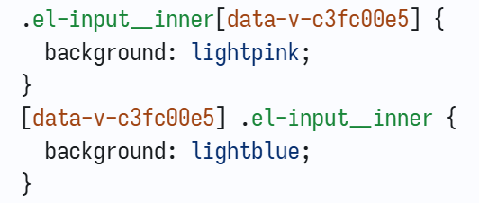

# Vue3 高级

- Vue 高级 [50, 60]
- 可视化 [68, 78]
- pm2, linux, 网络安全 [93, 114]
- TypeScript [全集]
- React [全集]
- 微前端 [全集]
- NestJS [全集]

## Event Loop 事件循环

JS 也支持多线程 webWorker, 但不允许操作 DOM

## KeepAlive 缓存组件

1. 默认缓存 KeepAlive 标签内的全部组件
2. include 属性: 缓存包含的组件, 支持字符串, 正则表达式或数组
3. exclude 属性: 不缓存排除的组件
4. max 属性: 缓存的最大组件数, 如果实际组件数 > max, 则使用 LRU 算法计算缓存哪些组件

```vue
<script lang="ts" setup>
import { ref } from "vue";
import KeepAliveBoy from "./KeepAliveBoy.vue";
import KeepAliveGirl from "./KeepAliveGirl.vue";

const flag = ref(true);
</script>

<template>
  <div>
    <el-button type="primary" @click="flag = !flag">切换组件</el-button>
    <KeepAlive :include="'KeepAliveBoy'" :exclude="[/'girl'/i]" :max="1">
      <KeepAliveBoy v-if="flag"></KeepAliveBoy>
      <KeepAliveGirl v-else></KeepAliveGirl>
    </KeepAlive>
  </div>
</template>
```

使用 KeepAlive 缓存组件时, 会增加两个生命周期 onActivated 和 onDeactivated

## Transition 过渡/动画组件

Transition 基于状态变化

### 对比 CSS 过渡 transition 和动画 animation

|              | 过渡 transition           | 动画 animation                       |
| ------------ | ------------------------- | ------------------------------------ |
| 触发         | 需要事件触发, 例如 :hover | 可以自动触发, 例如页面加载后自动播放 |
| 状态         | 只有起始状态和结束状态    | 可以使用 @keyframes 定义多个关键帧   |
| 自动循环播放 | 不支持                    | 支持                                 |

### Transition 生命周期钩子和 animation.css

[animation.css](https://animate.style/)

```bash
pnpm install animate.css
```

- beforeEnter, enter, afterEnter, enterCancelled
- beforeLeave, leave, afterLeave, leaveCancelled

::: code-group

```vue [script]
<script lang="ts" setup>
import "animate.css";

const display = ref(true);

function enterActive(el: Element, done: () => void) {
  console.log("enterActive");
  setTimeout(() => done(), 3000);
}

function leaveActive(el: Element, done: () => void) {
  console.log("leave-active");
  setTimeout(() => done(), 3000);
}
</script>
```

```vue [template]
<template>
  <div>
    <el-button type="primary" @click="display = !display">switch</el-button>
    <!-- 等价于
    <Transition
      enter-active-class="animate__animated animate__fadeIn"
      leave-active-class="animate__animated animate__fadeOut"
    > -->
    <!-- duration: 过渡动画持续 1s -->
    <Transition
      class="animate__animated"
      enter-active-class="animate__fadeIn"
      leave-active-class="animate__fadeOut"
      :duration="1000"
      @beforeEnter="(el: Element) => console.log('beforeEnter')"
      @enter="enterActive"
      @afterEnter="(el: Element) => console.log('afterEnter')"
      @enterCancelled="(el: Element) => console.log('enterCancelled')"
      @before-leave="(el: Element) => console.log('before-leave')"
      @leave="leaveActive"
      @after-leave="(el: Element) => console.log('after-leave')"
      @leave-cancelled="(el: Element) => console.log('leave-cancelled')"
    >
      <div class="box" v-if="display">Transition With Animate.css</div>
    </Transition>

    <Transition name="fade">
      <!-- className prefix -->
      <div class="box" v-show="display" style="background: lightpink">
        Transition
      </div>
    </Transition>
  </div>
</template>
```

```vue [style]
<style lang="scss" scoped>
@mixin wh0 {
  width: 0;
  height: 0;
}

@mixin wh200 {
  width: 200px;
  height: 200px;
}

.box {
  @include wh200;
  background: lightblue;
}

.fade-enter-from {
  @include wh0;
  transform: rotate(360deg);
}

.fade-enter-active {
  transition: all 3s ease;
}

// .fade-enter-to {}
// .fade-leave-from {}

.fade-leave-active {
  transition: all 3s ease;
}

.fade-leave-to {
  @include wh0;
  transform: rotate(360deg);
}
</style>
```

:::

### Transition 案例

```vue
<!-- pnpm add gsap -->
<script lang="ts" setup>
import gsap from "gsap";

const mountOrNot = ref(true);
</script>

<template>
  <div>
    <el-button type="success" @click="mountOrNot = !mountOrNot"
      >switch</el-button
    >
    <Transition
      @beforeEnter="
        (el: Element) => {
          gsap.set(el, {
            width: 0,
            height: 0,
          });
        }
      "
      @enter="
        // type Callback = (...args: any[]) => void | null;
        (el: Element, done: gsap.Callback) => {
          gsap.to(el, {
            width: 200,
            height: 200,
            onComplete: done,
          });
        }
      "
      @leave="
        (el: Element, done: gsap.Callback) => {
          gsap.to(el, {
            width: 0,
            height: 0,
            onComplete: done,
          });
        }
      "
    >
      <div v-if="mountOrNot" class="box">Transition With GASP</div>
    </Transition>
  </div>
</template>

<style lang="scss" scoped>
.box {
  height: 200px;
  width: 200px;
  background: lightgreen;
}
</style>
```

### TransitionGroup

> [!warning]
>
> - Transition 只允许一个直接子元素; Transition 包裹组件时, 组件必须有唯一的根元素, 否则不能被动画化
> - TransitionGroup 允许多个直接子元素

```vue
<script lang="ts" setup>
import { reactive } from "vue";
import "animate.css";

const list = reactive<number[]>([1, 2, 3, 4, 5]);
</script>

<template>
  <el-button @click="list.push(list.length + 1)">push</el-button>
  <el-button @click="list.pop()">pop</el-button>
  <!-- tag="section" tag 属性为多个 div 包裹一层 section 标签 -->
  <div class="wrapper">
    <TransitionGroup
      tag="section"
      enter-active-class="animate__animated animate__bounceIn"
      leave-active-class="animate__animated animate__bounceOut"
    >
      <div class="item" v-for="(item, idx) of list" :key="idx">{{ item }}</div>
    </TransitionGroup>
  </div>
</template>

<style lang="scss" scoped>
.wrapper > section {
  display: flex;
  // flex-wrap: nowrap; // 单行 flex 容器
  flex-wrap: wrap; // 多行 flex 容器
  border: 1px solid #ccc;
  .item {
    margin: 0 10px;
  }
}
</style>
```

### TransitionGroup 案例

```vue
<!-- pnpm i lodash @types/lodash -->
<script lang="ts" setup>
import { ref } from "vue";
import { shuffle } from "lodash";

// [undefined, undefined, undefined]
// new Array(3).fill(undefined)
// 等价于 Array.from({ length: 3 })
// 等价于 Array.apply(null, { length: 3 })
const list = ref(
  Array.apply(null, {
    length: 81,
  } as number[]).map((val, idx) => ({
    id: idx,
    val: (idx % 9) + 1,
  })),
);

function shuffleList() {
  list.value = shuffle(list.value);
}
</script>

<template>
  <div>
    <el-button @click="shuffleList">shuffleList</el-button>
    <!-- move-class: 平移的过渡效果 -->
    <TransitionGroup move-class="mv" class="wrapper" tag="div">
      <!-- v-for 绑定 key 时不能使用 idx, 否则无法实现过渡效果 -->
      <div class="item" v-for="item of list" :key="item.id">
        {{ item.val }}
      </div>
    </TransitionGroup>
  </div>
</template>

<style lang="scss" scoped>
.wrapper {
  display: flex;
  flex-wrap: wrap; // 多行 flex 容器
  width: calc(27px * 9);
  .item {
    width: 25px;
    height: 25px;
    border: 1px solid #ccc;
    display: flex;
    justify-content: center; /** 水平居中 */
    align-items: center; /** 垂直居中 */
  }
}

.mv {
  transition: all 1s;
}
</style>
```

## [GASP](https://gsap.com/) 动画库

案例: GASP 状态过渡

```vue
<script setup lang="ts">
import gsap from "gsap";
const num = reactive({
  curVal: 0,
  tweenVal: 0,
});

watch(
  () => num.curVal, // getter
  (newVal, oldVal) => {
    console.log(newVal, oldVal);
    gsap.to(num, {
      duration: 1,
      tweenVal: newVal,
    });
  },
);
</script>

<template>
  <div>
    <el-input v-model="num.curVal" :step="20" type="number"></el-input>
    <div>
      {{ num.tweenVal.toFixed(0) }}
    </div>
  </div>
</template>
```

## Vue 中使用 JSX

| Vue                | JSX                                          |
| ------------------ | -------------------------------------------- |
| v-bind 或 :        | type={item.type}                             |
| v-on 或 @          | onEventType={ callback }                     |
| v-if               | if...else 或三元运算符                       |
| v-show             | if...else 或三元运算符, `vueJsx` 也支持      |
| v-for              | 数组的 map 方法                              |
| props, emit, slots | setup(props, { emit, slots } /\*_ ctx _/) {} |
| v-model            | v-bind + 事件回调, `vueJsx` 也支持           |

```tsx
export default defineComponent({
  setup(props: IProps, { emit, slots } /** ctx */) {
    return () => <></>;
  },
});
```

> [!warning] Babel
> 源代码 == 编译器 (parse) ==>
> 抽象语法树 AST == 转换过程 (transform) ==>
> 修改后的 AST == 生成器 (generator) ==>
> 转换后的代码

## 手写 Vite 插件解析 JSX

安装依赖

```bash
pnpm i @vue/babel-plugin-jsx -D
pnpm i @babel/core -D
pnpm i @babel/plugin-transform-typescript -D
pnpm i @babel/plugin-syntax-import-meta -D
pnpm i @types/babel__core -D
```

```ts
/* eslint-disable @typescript-eslint/ban-ts-comment */
// Vite Plugin JSX/TSX
import type { Plugin } from "vite";
import babel from "@babel/core";
import babelPluginJsx from "@vue/babel-plugin-jsx";

export function vitePluginTsx(): Plugin {
  return {
    name: "vite-plugin-tsx",
    config(/** config */) {
      return {
        esbuild: {
          include: /\.ts$/,
        },
      };
    },
    async transform(code, id) {
      if (/.tsx$/.test(id)) {
        // @ts-ignore
        const ts = await import("@babel/plugin-transform-typescript").then(
          (res) => res.default,
        );
        const res = await babel.transformAsync(code, {
          ast: true, // ast 抽象语法树
          babelrc: false, // 没有 .babelrc 文件, 所以是 false
          configFile: false, // 没有 babel.config.json 文件, 所以是 false
          plugins: [
            babelPluginJsx,
            [ts, { isTSX: true, allowExtensions: true }],
          ],
        });
        // console.log(res?.code)
        return res?.code;
      }
      return code;
    },
  };
}
```

## 深入 v-model

v-model 属于 Vue3 的破坏式更新, 本质是一个语法糖, 是 父v-bind/子props 和 父v-on/子emit 的组合

1. 属性名: 默认 `modelValue`, `propName`
2. 事件名: 默认 `update:model-value`, `update:prop-name`
3. 支持多个 v-model
4. v-model 内置修饰符 .trim, .number, .lazy, 支持自定义修饰符 v-model.customModifier

`v-model="someValue"` 等价于 `v-model:modelValue="someValue"`, 等价于父组件 `v-bind:modelValue v-on:update:model-value="updateCallback"`, 子组件 `defineProps(['modelValue']), defineEmits('update:modelValue')`, 父组件的 `:modelValue="someValue"` 和子组件的 `defineProps(['modelValue'])` 实现了父到子的单向数据流, 子组件的 `defineEmits('update:modelValue')` 和父组件的 `@update:model-value="updateCallback"` 实现了子到父的单向数据流, 即 v-model 实现了双向数据绑定

自定义修饰符: 父组件 `v-model:modelValue.customModifier`, 子组件 `defineProps<{ modelValueModifiers? : { customModifier: boolean } }>()`, 自定义修饰符存在时为 true, 不存在时为 undefined

::: code-group

```vue [父组件]
<script setup lang="ts">
import ModelChild from "./ModelChild.vue";

const isShow = ref<boolean>(true);
const text = ref<string>("云深不知处");
</script>

<template>
  <main>
    <p>v-model 父组件</p>
    <div>isShow: {{ isShow }}</div>
    <div>text: {{ text }}</div>
    <div><button @click="isShow = !isShow">switch</button></div>
    <ModelChild
      v-model:modelValue="isShow"
      v-model:textVal.myModifier="text"
    ></ModelChild>
    <!-- 等价于
    v-bind props 属性名: modelValue
    v-on   emit 事件名: update:modelValue, update:model-value
    -->
    <ModelChild
      v-bind:modelValue="isShow"
      @update:model-value="(newVal) => (isShow = newVal)"
      v-bind:textVal="text"
      @update:text-val="(newVal) => (text = newVal)"
    ></ModelChild>
  </main>
</template>
```

```vue [子组件]
<script setup lang="ts">
const props = defineProps<{
  modelValue: boolean;
  // modelValueModifiers? : {}
  textVal: string;
  textValModifiers?: {
    myModifier: boolean; // 修饰符存在则为 true
  };
}>();

const emit = defineEmits(["update:modelValue", "update:textVal"]);
function closeHandler() {
  emit("update:modelValue", false);
}

function inputHandler(ev: Event) {
  console.log((ev.target as HTMLInputElement).value);
  emit("update:textVal", (ev.target as HTMLInputElement).value);
}
</script>

<template>
  <main class="main" v-if="modelValue">
    <div>v-model 子组件</div>
    <div>modelValue: {{ modelValue }}</div>
    <div>
      myModifier 是否存在: {{ props.textValModifiers?.myModifier ?? false }}
    </div>
    <div><button @click="closeHandler">close</button></div>
    <div>
      content: <input type="text" :value="textVal" @input="inputHandler" />
    </div>
  </main>
</template>
```

:::

## 自定义指令

| 组件生命周期的钩子函数 | 指令生命周期的钩子函数 |
| ---------------------- | ---------------------- |
| setup                  | created                |
| onBeforeMount          | beforeMount            |
| onMounted              | mounted                |
| onBeforeUpdate         | beforeUpdate           |
| onUpdated              | updated                |
| onBeforeUnmount        | beforeUnmount          |
| onUnmounted            | unmounted              |

自定义指令名: 以 v 开头, vDirectiveName

```vue
<script setup lang="ts">
import { ref, type Directive, type DirectiveBinding } from "vue";
import CustomDirectiveChild from "./CustomDirectiveChild.vue";

const vMyDirective: Directive = {
  created(...args) {
    console.log("created:", args);
  },
  beforeMount(...args) {
    console.log("beforeMount:", args);
  },
  mounted(
    el: HTMLElement,
    binding: DirectiveBinding<{ background: string; textContent: string }>,
  ) {
    console.log("mounted:", el, binding);
    el.style.background = binding.value.background;
    el.textContent = binding.value.textContent;
  },
  beforeUpdate(...args) {
    console.log("beforeUpdated:", args);
  },
  updated(...args) {
    const el = args[0];
    el.textContent = textContent.value;
    console.log("updated:", args);
  },
  beforeUnmount(...args) {
    console.log("beforeUnmount", args);
  },
  unmounted(...args) {
    console.log("unmounted", args);
  },
};

const isAlive = ref(true);
const textContent = ref("苏式绿豆汤");
function updateChild() {
  textContent.value += " yue!";
}
</script>

<template>
  <main>
    <button @click="isAlive = !isAlive">挂载/卸载</button>
    <button @click="updateChild">更新</button>
    <CustomDirectiveChild
      v-if="isAlive"
      v-my-directive:propName.myModifier="{
        background: 'lightpink',
        textContent: textContent,
      }"
    ></CustomDirectiveChild>
  </main>
</template>
```

### 自定义指令实现按钮鉴权

```vue
<script setup lang="ts">
import type { Directive, DirectiveBinding } from "vue";
localStorage.setItem("userId", "161043261");
// mock 后端返回的数据
const permissions = [
  "161043261:item:create",
  "161043261:item:update" /** , '161043261:item:delete' */,
];
const userId = localStorage.getItem("userId") as string;

const vIsShow: Directive<HTMLElement, string> = (
  el: HTMLElement,
  binding: DirectiveBinding<string>,
) => {
  // console.log(el, binding)
  if (!permissions.includes(userId + ":" + binding.value)) {
    el.style.display = "none"; // 如果没有权限, 则隐藏对应的按钮
  }
};
</script>

<template>
  <main>
    <div>
      <button v-is-show="'item:create'">创建</button>
      <button v-is-show="'item:update'">更新</button>
      <button v-is-show="'item:delete'">删除</button>
    </div>
  </main>
</template>
```

## 自定义 hook (一个异步函数)

::: code-group

```vue [父组件]
<script setup lang="ts">
import CustomHookChild from "./CustomHookChild.tsx";
import { useCustomHook } from "./CustomHookChild.tsx";

useCustomHook({ el: "#img" }).then((val) =>
  console.log("baseUrl:", val.baseUrl),
);
</script>

<template>
  <main>
    
    <CustomHookChild a="aa" b="bb" c="cc"></CustomHookChild>
  </main>
</template>
```

```tsx [子组件]
import { defineComponent, useAttrs, onMounted } from "vue";

export /** async */ function useCustomHook(options: {
  el: string;
}): Promise<{ baseUrl: string }> {
  return new Promise((resolve /** , reject */) => {
    onMounted(() => {
      const img = document.querySelector(options.el) as HTMLImageElement;
      // console.log(img)
      img.onload = () => {
        resolve({
          baseUrl: toBase64(img),
        });
      };
    });

    const toBase64 = (el: HTMLImageElement) => {
      const canvas = document.createElement("canvas");
      const ctx = canvas.getContext("2d");
      canvas.width = el.width;
      canvas.height = el.height;
      ctx?.drawImage(el, 0, 0, canvas.width, canvas.height);
      return canvas.toDataURL("image/svg");
    };
  });
}

export default defineComponent({
  props: ["c"],
  setup(props: { c: string }) {
    const attrs = useAttrs();
    console.log("attrs:", attrs);
    console.log("props:", props);
    return () => (
      <>
        <main>CustomHookChild</main>
      </>
    );
  },
});
```

:::

## 自定义指令 + 自定义 hook 综合案例

- InterSectionObserver 监听目标元素与祖先元素或视口相交情况的变化
- MutationObserver 监听整个 DOM 树的变化
- ResizeObserver 监听元素宽高的变化

::: code-group

```ts [@/utils/index.ts]
import { type App } from "vue";
function useResize(
  el: HTMLElement,
  callback: (contentRect: DOMRectReadOnly) => void,
) {
  const resizeObserver = new ResizeObserver((entries) => {
    callback(entries[0].contentRect);
  });
  resizeObserver.observe(el);
}

// Vue 插件: 一个有 install 属性的对象
// install 属性值: 接收一个 App 实例的函数
const install = (app: App) => {
  app.directive("resize", {
    mounted(el, binding) {
      console.log(binding.value);
      useResize(el, binding.value /** callback */);
    },
  });
};

useResize.install = install;
export default useResize;
```

```ts [index.ts]
import { createApp } from "vue";
import router from "@/router";

import App from "./App.vue";
import useResize from "@/utils";
const app = createApp(App);

app.use(router);
app.use(useResize);

app.mount("#app");
```

```vue [自定义 hook]
<script setup lang="ts">
import useResize from "@/utils";
import { onMounted } from "vue";
onMounted(() => {
  useResize(document.querySelector("#resize") as HTMLElement, (contentRect) =>
    console.log(contentRect),
  );
});
</script>

<template>
  <main>
    <div id="resize"></div>
  </main>
</template>
```

```vue [自定义指令]
<template>
  <main>
    <div
      v-resize="(rect: DOMRectReadOnly) => console.log(rect) /** callback */"
      id="resize"
    ></div>
  </main>
</template>
```

:::

## 全局变量, 全局函数

::: code-group

```ts [index.ts]
import { createApp } from "vue";
import App from "./App.vue";
const app = createApp(App);

// 全局变量
app.config.globalProperties.$env = "dev";
app.config.globalProperties.$api = {
  stringify<T>(arg: T) {
    return JSON.stringify(arg);
  },
};

app.mount("#app");

type Api = {
  stringify<T>(arg: T): string;
};

// 类型扩展
declare module "vue" {
  export interface ComponentCustomProperties {
    $env: string;
    $api: Api;
  }
}
```

```vue
<script lang="ts" setup>
import { getCurrentInstance } from "vue";

const app = getCurrentInstance();
console.log("$env:", app?.proxy?.$env);
console.log("$api.stringify:", app?.proxy?.$api.stringify({ a: 1, b: 2 }));
</script>

<template>
  <div>
    <div>$env: {{ $env }}</div>
    <div>$api.stringify: {{ $api.stringify({ a: 1, b: 2 }) }}</div>
  </div>
</template>
```

:::

## 全局变量/函数 + Vue 插件综合案例

- Vue 插件: 一个有 install 属性的对象
- install 属性值: 接收一个 App 实例的函数

::: code-group

```vue [MessageBox 消息弹出框]
<script setup lang="ts">
const isAlive = ref<boolean>(true);

function changeAlive() {
  isAlive.value = !isAlive.value;
}

defineExpose({
  isAlive,
  changeAlive,
});
</script>

<template>
  <main>
    <Transition
      enter-active-class="animate__animated animate__bounceIn"
      leave-active-class="animate__animated animate__bounceOut"
    >
      <div v-if="isAlive" class="loading">Say Goodbye</div>
    </Transition>
  </main>
</template>
```

```ts [@/utils/index.ts]
import { createVNode, render } from "vue";
import type { App, Plugin, Ref, VNode } from "vue";

const vuePlugin: Plugin = {
  install(app: App) {
    const vnode: VNode = createVNode(VuePluginDemo);
    render(vnode, document.body /** container */);
    app.config.globalProperties.$vuePluginDemo = {
      isAlive: vnode.component?.exposed?.isAlive,
      changeAlive: vnode.component?.exposed?.changeAlive,
    };
  },
};
// 类型扩展
declare module "vue" {
  export interface ComponentCustomProperties {
    $vuePluginDemo: {
      isAlive: Ref<boolean>;
      changeAlive: () => void;
    };
  }
}
```

```ts [main.ts 注册插件]
import { vuePlugin } from "@/utils";
app.use(vuePlugin);
```

```tsx [使用插件]
import { defineComponent, getCurrentInstance } from "vue";

export default defineComponent({
  setup() {
    const app = getCurrentInstance();
    return () => (
      <>
        <div>isAlive: {`${app?.proxy?.$vuePluginDemo.isAlive.value}`}</div>
        <button onClick={() => app?.proxy?.$vuePluginDemo.changeAlive()}>
          changeAlive
        </button>
      </>
    );
  },
});
```

:::

## 手写 `app.use()` 源码

::: code-group

```ts [myUse]
import type { App } from "vue";

interface Plugin {
  install?: (app: App, ...options: Array<any>) => any;
}
const installed = new Set();

export function myUse<T extends Plugin>(plugin: T, ...options: Array<any>) {
  if (installed.has(plugin)) {
    console.warn(plugin, "重复注册");
  } else {
    // @ts-ignore
    plugin.install(this as App /** app */, ...options);
    installed.add(plugin);
  }
}
```

```ts [main.ts]
import "@/assets/main.scss";

import { createApp } from "vue";
import App from "./App.vue";
import { vuePlugin } from "@/utils";
import { myUse } from "./utils/myUse";
const app = createApp(App);

// app.use(vuePlugin)
myUse.bind(app)(vuePlugin);
myUse.bind(app)(vuePlugin); // {install: ƒ} '重复注册'
```

:::

## nextTick

Vue 同步更新数据, 异步更新 DOM

> [!caution] Vue 异步更新 DOM
>
> 1. Vue 将 DOM 更新加入更新队列, 等到下一个事件循环时, 才批量更新 DOM
> 2. nextTick 延迟执行回调函数, 即等待下一个事件循环 DOM 更新后, 再执行 callback

案例

```vue
<script setup lang="ts">
import { reactive, ref, useTemplateRef, nextTick } from "vue";

const itemList = reactive([
  { name: "item1", id: 1 },
  { name: "item2", id: 2 },
]);

const ipt = ref("");
const box = useTemplateRef<HTMLDivElement>("box");

//! Vue 同步更新数据, 异步更新 DOM
// 所以滚动位置 scrollTop 不会实时更新
function addItem() {
  itemList.push({ name: ipt.value, id: itemList.length });
  // 同步代码执行后, 异步更新 DOM
  // nextTick 可以接收一个回调函数
  nextTick(
    () => {
      box.value!.scrollTop = 520520520; // 更新滚动位置
    } /** callback */,
  );
}

async function addItem2() {
  itemList.push({ name: ipt.value, id: itemList.length });
  await nextTick(); // 等待下一个事件循环结束 (DOM 已更新)
  box.value!.scrollTop = 520520520; // 更新滚动位置
}
</script>

<template>
  <main>
    <div ref="box" class="wrapper">
      <div class="item" v-for="item in itemList" :key="item.name">
        <div>id: {{ item.id }}, name: {{ item.name }}</div>
      </div>

      <!-- ipt: input -->
      <div class="ipt">
        <textarea v-model="ipt" type="text"></textarea>
        <button @click="addItem">addItem</button>
        <button @click="addItem2">addItem2</button>
      </div>
    </div>
  </main>
</template>
```

## scoped 和 :deep() 样式穿透

Vue 的 scoped: 样式私有化, 模块化

1. 为 DOM 元素添加不重复的 `data-v-hash` 属性 (通过 postcss 实现)
2. CSS 使用例如 `.main[data-v-hash]` 属性选择器, 以实现样式私有化, 模块化
3. 如果父组件中包含子组件, 只为子组件的最外层标签添加父组件的 `v-data-hash` 属性
4. babel 将 JS -> AST, postcss 将 CSS -> AST

::: code-group

```html [输出的 HTML]
<main data-v-121257cf="">
  <p data-v-121257cf="">v-model 父组件</p>
  <main data-v-241fa5d4="" data-v-121257cf="" class="main">
    <div data-v-241fa5d4="">v-model 子组件</div>
  </main>
  <main data-v-241fa5d4="" data-v-121257cf="" class="main">
    <div data-v-241fa5d4="">v-model 子组件</div>
  </main>
</main>
```

```css [输出的 CSS]
.main[data-v-241fa5d4] {
  border: 1px solid #ccc;
  width: 50vw;
  padding: 5px;
}
```

:::

样式穿透 `:deep()` 用于修改 [element-plus](https://element-plus.org/zh-CN/component/overview.html), [antd-vue](https://antdv.com/components/overview-cn), [vant](https://vant-ui.github.io/vant/#/zh-CN/quickstart), [tailwind UI](https://tailwindui.com/components) 的默认样式

```vue
<script setup lang="ts">
import { ElInput } from "element-plus";
import { ref } from "vue";
const ipt = ref("");
</script>

<template>
  <main>
    <ElInput v-model:model-value="ipt">尽情的输入</ElInput>
  </main>
</template>

<style scoped lang="css">
.el-input__inner {
  /** BEM 架构 */
  background: lightpink;
}

:deep(.el-input__inner) {
  /** 样式穿透, BEM 架构 */
  background: lightblue;
}
</style>
```

打包后



## Vue 其他 CSS 特性

### :slotted() 插槽选择器

::: code-group

```vue [子组件]
<template>
  <main>
    <div>匿名插槽</div>
    <slot></slot>
  </main>
</template>

<style scoped lang="css">
:slotted(.default-slot-template) {
  width: 200px;
  height: 200px;
  background: azure;
}
</style>
```

```vue [父组件]
<script setup lang="ts">
import SlotSelectorChild from "./SlotSelectorChild.vue";
</script>

<template>
  <main>
    <SlotSelectorChild>
      <div class="default-slot-template">父组件插入到子组件的匿名插槽</div>
    </SlotSelectorChild>
  </main>
</template>
```

:::

### :global 全局选择器

1. 不加 scoped, 就是全局选择器
2. 加 scoped, 并使用 `:global(button) {}`, 也是全局选择器

### 动态 CSS

可以在 style 块中使用 v-bind

```vue
<script setup lang="ts">
const bg = ref("lightpink");
const style = ref({
  color: "white",
});
setInterval(() => {
  bg.value = bg.value === "lightpink" ? "lightblue" : "lightpink";
}, 1000);
</script>

<template>
  <main>
    <div class="dynamic-css">动态 CSS</div>
  </main>
</template>

<style scoped lang="css">
.dynamic-css {
  width: 30vw;
  text-align: center;
  background: v-bind(bg);
  color: v-bind("style.color");
}
</style>
```

### CSS 模块化

```vue
<script setup lang="ts">
import { useCssModule } from "vue";

const styleMod = useCssModule(); // 默认模块 $style
const customMod = useCssModule("customModule"); // 自定义模块 customMod
console.log(styleMod);
console.log(customMod);
// 场景
// () => (<div class={$style.box}>这是 JSX</div>)
</script>

<template>
  <main style="display: flex">
    <!-- 默认模块 $style -->
    <div :class="$style.box">CSS Module</div>
    <!-- class 可以绑定数组 -->
    <div :class="[$style.box, $style.border]">CSS Module2</div>
    <!-- 可以自定义模块名 -->
    <div :class="[$style.box, customModule.bg]">CSS Module3</div>
  </main>
</template>

<style module lang="css">
.box {
  width: 100px;
  height: 100px;
  background: lightblue;
}

.border {
  border: 1px solid #000;
}
</style>

<!-- 可以自定义模块名 -->
<style module="customModule">
.bg {
  background: lightpink;
}
</style>
```

## Vue 集成 [tailwindcss](https://www.tailwindcss.cn/docs/installation)

请看 (README.md)[https://github.com/161043261/ffmpeg-wrapper/blob/main/README.md]

## H5 适配

```html
<!-- 移动端适配: 设置 meta 标签 -->
<meta name="viewport" content="width=device-width,initial-scale=1" />
```

### 圣杯布局

两侧盒子宽度固定, 中间盒子宽度自适应的三栏布局, 其中中间盒子放在文档流前面, 保证先渲染

1. 1px 大约 2~3 mm
2. rem: html 标签的 font-size
3. vw, vh: 相对视口宽高; 百分比: 相对父元素宽高

```vue
<script setup lang="ts">
import { useCssVar } from "@vueuse/core";

function changeFontSize(pixel: number) {
  const fontSize = useCssVar("--font-size");
  fontSize.value = `${pixel}px`;
  // 实现原理
  // document.documentElement.style.setProperty('--font-size', `${pixel}px`)
}
</script>

<template>
  <header class="header">
    <div>left</div>
    <div>
      center
      <button @click="changeFontSize(36)">大号字体</button>
      <button @click="changeFontSize(24)">中号字体</button>
      <button @click="changeFontSize(12)">小号字体</button>
    </div>
    <div>right</div>
  </header>
</template>

<style scoped lang="scss">
/**
全局字体大小: 定义根元素的 CSS 变量, 任何页面都可以使用
也可参考 vitepress 的 `.vitepress/theme/style.css` 全局样式
 */
:root /** 即 html */ {
  --font-size: 24px;
}

.header {
  display: flex;

  div {
    height: 50px;
    line-height: 50px;
    color: #fff;
    text-align: center;
    font-size: var(--font-size);
  }

  div:nth-child(1) {
    width: 100px; /** 建议使用 vw */
    background-color: lightpink;
  }
  div:nth-child(2) {
    /** flex: 1
    可以拉伸, 可以压缩, 初始长度为 0 (伸缩项目的宽或高失效)
    */
    flex: 1; // 自适应
    background-color: lightblue;
  }
  div:nth-child(3) {
    width: 100px; /** 建议使用 vw */
    background-color: lightgreen;
  }
}
</style>
```

### 编写 postcss 插件

```ts
/**
 * @description Pixel to viewport postcss plugin.
 */
import { Plugin } from "postcss";

const defaultOptions = {
  viewportPixelWidth: 375, // UI 设计稿指定的宽度, 单位 px
};

interface IOptions {
  viewportPixelWidth?: number;
}

export const px2vw = (options: IOptions = defaultOptions): Plugin => {
  const opt = { ...options, ...defaultOptions };
  // 等价于 const opt = Object.assign({}, defaultOptions, options)
  return {
    postcssPlugin: "pixel2viewport",
    // 获取 CSS 节点
    Declaration(node) {
      if (node.value.includes("px")) {
        // px 转 vw
        return;
        // console.log(node.value, node.prop)
        const val = parseFloat(node.value);
        node.value = `${((val / opt.viewportPixelWidth) * 100).toFixed(2)}vw`;
      }
    },
  };
};
```

`vite.config.ts` 中使用 postcss 插件

```ts
import { px2vw } from "./plugins/postcss";

// https://vite.dev/config/
export default defineConfig({
  /** ... */
  css: {
    postcss: {
      // 自定义 postcss 插件
      plugins: [px2vw()],
    },
  },
});
```

### 案例: 全局修改字体大小

1. 全局字体大小: 定义根元素 `:root` 的 CSS 变量, 所有页面都可以使用
2. 可以参考 vitepress 如何设置全局样式

```bash
pnpm i @vueuse/core
```

```ts
import { useCssVar } from "@vueuse/core";

function changeFontSize(pixel: number) {
  const fontSize = useCssVar("--font-size");
  fontSize.value = `${pixel}px`;
  // 实现原理
  // document.documentElement.style.setProperty('--font-size', `${pixel}px`)
}
```

## UnoCSS: CSS 原子化

CSS 原子化的优点: CSS 复用, 减小 CSS 体积

```bash
pnpm add -D unocss
pnpm add -D @iconify-json/ic
```

Vite 项目中使用 UnoCSS

[iconify](https://iconify.design/)

::: code-group

```ts [vite.config.ts]
import unoCss from "unocss/vite";

// https://vite.dev/config/
export default defineConfig({
  plugins: [
    /** ... */
    unoCss({
      // 预设
      presets: [presetIcons(), presetAttributify(), presetUno()],
      rules: [
        ["_border", { border: "1px solid #ccc" }],
        [/^_w-(\d+)$/, ([, d]) => ({ width: `${Number(d)}px` })],
        [/^_p-(\d+)$/, ([, d]) => ({ padding: `${Number(d)}px` })],
      ],
      shortcuts: {
        cheerChen: ["_border", "_w-100", "_p-10"],
      },
    }),
  ],
});
```

```ts [main.ts]
import "uno.css";
// ...
```

```vue [使用 UnoCSS]
<template>
  <main>
    <div class="_border _w-100 _p-10">UnoCSS Demo</div>
    <div class="cheerChen">UnoCSS Demo2</div>
    <!-- https://icon-sets.iconify.design/ic/page-3.html -->
    <!-- presetIcons() 预设 -->
    <div class="i-ic-baseline-apple"></div>
    <!-- presetAttributify() 预设 -->
    <div _border _w="100" _p="10">UnoCSS Demo3</div>
    <div cheerChen>UnoCSS Demo4</div>
    <!-- presetUno() 预设: 集成了 tailwindcss 等... -->
  </main>
</template>
```

:::

## Vue 函数式编程

h 函数原理是 `createVNode`, 优点是跳过了模板的编译 (`<template>` ==parser=> AST ==transformer=> JS API ==generator=> render 渲染函数)

```vue
<script setup lang="ts">
import { h, reactive } from "vue";

const list = reactive([
  { id: 1, name: "item1", age: 11 },
  { id: 2, name: "item2", age: 22 },
  { id: 3, name: "item3", age: 33 },
]);

interface IProps {
  type: "success" | "error";
}

// Vue 函数式编程
const OperateButton = (props: IProps, ctx: any /** { emit, slots } */) => {
  return h(
    /* HyperScript */ "button", // type
    {
      style: { color: props.type === "success" ? "green" : "red" },
      onClick: () => {
        console.log(ctx);
      },
    }, // props
    ctx.slots.default(), // children
  );
};
</script>

<template>
  <main>
    <table>
      <thead>
        <tr>
          <th>name</th>
          <th>age</th>
          <th>operate</th>
        </tr>
      </thead>
      <tbody>
        <tr v-for="item of list" :key="item.id">
          <td>{{ item.name }}</td>
          <td>{{ item.age }}</td>
          <td>
            <OperateButton type="success">修改</OperateButton>
            <OperateButton type="error">删除</OperateButton>
          </td>
        </tr>
      </tbody>
    </table>
  </main>
</template>
```

## Vue 编译宏

### defineProps, defineEmits

::: code-group

```vue [父组件]
<script setup lang="ts">
import VueMacroChild from "./VueMacroChild.vue";
</script>

<template>
  <main>
    <VueMacroChild
      :name="['whoami']"
      @my-groupies="(...args) => console.log(args)"
    ></VueMacroChild>
  </main>
</template>
```

```vue [子组件]
<!-- <script setup lang="ts">
// import type { PropType } from 'vue'
// const props = defineProps({
//   name: { type: Array as PropType<string[]>, required: true },
// })
const props = defineProps<{
  name: string[]
}>()
</script> -->

<!-- 泛型支持 -->
<script generic="T /** extends object */" lang="ts" setup>
const props = defineProps<{
  name: T[];
}>();
console.log(props.name);
// const emit = defineEmits(['eventName'])
const emit = defineEmits<{
  // <eventName>: <expected arguments>
  // (eventName: string, arg: number, arg2: string): void;
  myGroupies: [arg: number, arg2: string]; // 命名元组语法
}>();
</script>

<template>
  <main>
    <button @click="emit('myGroupies', 1, 'arg')"></button>
  </main>
</template>
```

:::

### defineOptions

```ts
defineOptions({
  // 属性和 Options API 相同: data, methods, render, ...
  // 不能定义 props 和 emits, 使用 defineProps, defineEmits
  name: "VueMacroChild",
});
```

### defineSlots

::: code-group

```vue [父组件]
<script setup lang="ts">
import DefineSlotChild from "./DefineSlotChild.vue";
const list = [
  {
    name: "item1",
    age: 1,
  },
  {
    name: "item2",
    age: 2,
  },
];
</script>

<template>
  <main>
    <DefineSlotChild :list="list">
      <!-- item 先通过子组件的 props 父传子,
      再通过子组件的 slot 子传父, v-slot 等价于 # -->
      <template #default="{ item, idx }">
        <div>{{ `idx: ${idx}, name: ${item.name}, age: ${item.age}` }}</div>
      </template>
    </DefineSlotChild>
  </main>
</template>
```

```vue [子组件]
<!-- 泛型支持 -->
<script generic="T extends object" setup lang="ts">
import { toRef } from "vue";
const props = defineProps<{ list: T[] }>();
const list = toRef(props, "list");
defineSlots<{
  default(props: { item: T; idx: number }): void;
}>();
</script>

<template>
  <main>
    <ul>
      <li v-for="(item, idx) of list" :key="idx">
        <!-- 匿名插槽 -->
        <slot :item="item" :idx="idx"></slot>
      </li>
    </ul>
  </main>
</template>
```

:::

## 环境变量

在项目根目录下创建 `.env.development`, `.env.production`, 修改 `package.json`

::: code-group

```bash [.env.development]
VITE_HTTP = 'http://121.41.121.204:8080'
```

```bash [.env.production]
VITE_HTTP = 'http://121.41.121.204:80'
```

```json [package.json]
{
  "scripts": {
    "dev": "vite --mode development"
  }
}
```

:::

使用 `import.meta.env` 读取项目根目录下的 `.env.development`, `.env.production`

```ts
//! pnpm dev
console.log("import.meta.env:", import.meta.env);
// {
//   BASE_URL: '/',
//   DEV: true,
//   MODE: 'development',
//   PROD: false,
//   SSR: false
//   VITE_HTTP: 'http://121.41.121.204:8080'
// }
```

`vite.config.ts` 是 Node.js 环境, 无法使用 `import.meta.env` 读取项目根目录下的 `.env.development`, `.env.production`

```ts{7}
import { defineConfig, loadEnv } from "vite";
// export default defineConfig({/** ... */});

// console.log(process.env)
export default ({ mode }: { mode: string }) => {
  console.log("mode:", mode); // mode: development
  console.log(loadEnv(mode, process.cwd())); // { VITE_HTTP: 'http://121.41.121.204:8080' }
  return defineConfig({
    /** ... */
  });
};
```

## 使用 [Webpack](https://webpack.docschina.org/concepts/) 构建 Vue3 项目

见 [vue-webpack](https://github.com/161043261/type/tree/main/awesome/vue-webpack)

## Vue3 性能优化

检查 -> Lighthouse -> 分析网页加载情况

- FCP, First Contentful Paint 首次内容绘制时间: 从页面开始加载到浏览器首次渲染出内容的时间 (用户首次看到内容的时间, 内容: 首个文本或首张图片)
- SI, Speed Index 速度指数: 页面的各个可视区域的平均绘制时间, 页面等待后端发送的数据时, 会影响到 Speed Index
- LCP, Largest Contentful Paint 最大 DOM 元素的绘制时间
- TTI, Time to Interactive 首次可交互时间: 从页面开始加载到用户与页面可以交互的时间, 此时页面渲染已完成, 交互元素绑定的事件已注册
- TBT, Total Blocking Time 总阻塞时间: 从页面开始加载到首次可交互时间 (TTI) 期间, 主线程被阻塞, 无法与用户交互的总时间
- CLS, Cumulative Layout Shift 累积布局偏移: 比较两次渲染的布局偏移情况

### 分析 Vite 项目打包后的代码体积

```bash
# 适用于 vite 项目, vite 基于 rollup
pnpm install rollup-plugin-visualizer -D
# 适用于 webpack 项目
pnpm install webpack-bundle-analyzer -D
```

`vite.config.ts` 中使用 `rollup-plugin-visualizer` 插件

```ts
import { visualizer } from "rollup-plugin-visualizer";

export default defineConfig({
  plugins: [visualizer({ open: true })],
  build: {
    // 代码块 (chunk) 大小 >2000 KiB 时警告
    chunkSizeWarningLimit: 2000,
    cssCodeSplit: true, // 开启 CSS 拆分
    sourcemap: false, // 不生成源代码映射文件 sourcemap
    minify: "esbuild", // 最小化混淆, esbuild 打包速度最快, terser 打包体积最小
    cssMinify: "esbuild", // CSS 最小化混淆
    assetsInlineLimit: 5000, // 静态资源大小 <5000 Bytes 时, 将打包为 base64
  },
});
```

### PWA 渐进式 Web 应用程序, 离线缓存技术

1. 可以添加到桌面, 基于 manifest 实现
2. 可以离线缓存, 基于 service worker 实现
3. 可以发送应用程序通知, 基于 service worker 实现

```bash
pnpm install vite-plugin-pwa
pnpm install -g http-server
pnpm build
cd dist && http-server -p 5173
```

vite.config.ts

```ts
import { VitePWA } from "vite-plugin-pwa";

// https://vite.dev/config/
export default defineConfig({
  plugins: [
    VitePWA({
      // dist/manifest.webmanifest, dist/sw.js
      workbox: {
        cacheId: "d2vue", // 缓存名
        runtimeCaching: [
          {
            urlPattern: /.*\.js.*/, // 缓存文件
            handler: "StaleWhileRevalidate", // 重新验证时失效
            options: {
              cacheName: "d2vue-js",
              expiration: {
                maxEntries: 30, // 最大缓存文件数量, LRU 算法
                maxAgeSeconds: 30 * 24 * 60 * 60, // 缓存有效期
              },
            },
          },
        ],
      },
    }),
  ],
});
```

- 虚拟滚动列表, 参考 element-plus [Virtualized Table 虚拟化表格](https://element-plus.org/zh-CN/component/table-v2.html)
- WebWorker 多线程: vue-use `useWebWorker`
- 防抖, 节流: vue-use `useDebounceFn, useThrottleFn`

## Web Component 自定义元素

### 原生自定义元素

::: code-group

```js [btn.js]
class Btn extends HTMLElement {
  constructor() {
    super();
    // shallow DOM: 样式隔离
    const shallowDom = this.attachShadow({ mode: "open" });
    this.p = this.h("p");
    this.p.innerText = "d2vue Btn";
    this.p.setAttribute(
      "style",
      `width: 100px;
       height: 30px;
       line-height: 30px;
       text-align: center;
       border: 1px solid #ccc;
       border-radius: 5px;
       cursor: pointer;
       `,
    );
    shallowDom.appendChild(this.p);
  }

  h /**HyperScript */(el) {
    return document.createElement(el);
  }
}

window.customElements.define("d2vue-btn", Btn);
```

```js [btn2.js]
class Btn2 extends HTMLElement {
  constructor() {
    super();
    // shallow DOM: 样式隔离
    const shallowDom = this.attachShadow({ mode: "open" });
    this.template = this.h("template");
    this.template.innerHTML = `
      <style>
      p {
        width: 100px;
        height: 30px;
        line-height: 30px;
        text-align: center;
        border: 1px solid #ccc;
        border-radius: 5px;
        cursor: pointer;
      }
      </style>
      <p>d2vue Btn2</p>`;
    shallowDom.appendChild(this.template.content.cloneNode(true));
  }

  h /**HyperScript */(el) {
    return document.createElement(el);
  }
  connectedCallback() {
    console.log("Connected");
  }
  disconnectedCallback() {
    console.log("Disconnect");
  }
  adoptedCallback() {
    console.log("Adopted");
  }
  attributeChangedCallback() {
    console.log("Attribute changed");
  }
}

window.customElements.define("d2vue-btn2", Btn2);
```

```html [index.html]
<!doctype html>
<html lang="en">
  <head>
    <meta charset="UTF-8" />
    <meta name="viewport" content="width=device-width, initial-scale=1.0" />
    <title>Native Custom Element</title>
    <script src="./btn.js"></script>
    <script src="./btn2.js"></script>
  </head>
  <body>
    <d2vue-btn></d2vue-btn>
    <d2vue-btn2 />
  </body>
</html>
```

:::

### Vue 自定义元素

vite.config.ts

```ts
import { defineConfig /** , loadEnv */ } from "vite";

// https://vite.dev/config/
export default defineConfig({
  plugins: [
    vue({
      template: {
        compilerOptions: {
          // 文件名后缀为 .ce.vue 的文件, 前缀为 d2vue-, 将被视为自定义元素
          isCustomElement: (tag) => tag.startsWith("d2vue-"),
        },
      },
    }),
  ],
});
```

::: code-group

```vue [d2vue-btn.ce.vue]
<script setup lang="ts">
defineProps<{ item: { name: string; age: number } }>();
</script>

<template>
  <p>name: {{ item.name }}, age: {{ item.age }}</p>
</template>

<style scoped lang="css">
p {
  width: 200px;
  height: 30px;
  line-height: 30px;
  text-align: center;
  border: 1px solid #ccc;
  border-radius: 5px;
  cursor: pointer;
}
</style>
```

```vue [App.vue]
<script lang="ts" setup>
import D2vueBtn from "@/components/d2vue-btn.ce.vue";
import { defineCustomElement } from "vue";
// 自定义元素
const Btn = defineCustomElement(D2vueBtn);
window.customElements.define("d2vue-btn", Btn);
const item = { name: "whoami", age: 22 };
</script>

<template>
  <div>
    <d2vue-btn
      :item="item /** 较早版本需要 JSON.stringify(item) */"
    ></d2vue-btn>
  </div>
</template>
```

:::

## Proxy 跨域

同源: 两个 URL 的协议, 端口和主机都相同

### JSONP

原理: HTML 文件的 `<script>` 标签没有跨域限制

::: code-group

```html [frontend -> localhost:5500]
<script>
  function jsonp(req) {
    const script = document.createElement("script");
    const url = `${req.url}?callback=${req.callback.name}`;
    script.src = url;
    document.getElementsByTagName("head")[0].appendChild(script);
  }
  function namedCallback(res) {
    alert(`JSONP: ${res.data}`);
  }
  jsonp({
    url: "http://localhost:8080",
    callback: namedCallback,
  });
</script>
```

```js [backend -> localhost:8080]
import http from "node:http";
import urllib from "node:url";

const port = 8080;
const replyArgs = { data: "200" };
http
  .createServer((req, res) => {
    const params = urllib.parse(req.url, true);
    if (params.query.callback) {
      console.log("callback:", params.query.callback); // callback: namedCallback
      //                                      jsonp
      const chunk = `${params.query.callback}(${JSON.stringify(replyArgs)})`;
      console.log("chunk:", chunk); // chunk: namedCallback({"data":"200"})
      res.end(chunk);
    } else {
      res.end();
    }
  })
  .listen(port, () => {
    console.log(`Server: http://localhost:${port}`);
  });
```

:::

### 后端设置 CORS, 允许跨域资源共享

```json
{
  "Access-Control-Allow-Origin": "https://121.41.121.204", // 指定主机可访问
  "Access-Control-Allow-Origin": "*" // 任意主机可访问, 不安全
}
```

### 前端代理

> [!warning]
> 前端代理只适用于开发环境

Vite 代理

::: code-group

```js [backend -> localhost:8080]
import express from "express";
const port = 8080;
const app = express();

app.get("/user", (req, res) => {
  res.json({
    code: 200,
    message: "200",
  });
});

app.listen(port, () => {
  console.log(`Server: http://localhost:${port}`);
});
```

```ts [vite.config.ts]
export default defineConfig({
  server: {
    proxy: {
      "/api": {
        target: "http://localhost:8080",
        rewrite: (path) => path.replace(/^\/api/, ""),
      },
    },
  },
});
```

```vue [frontend -> localhost:5173]
<script lang="ts" setup>
// fetch('http://localhost:8080/user')
fetch("/api/user")
  .then((res) => res.json())
  .then((data) => console.log(data));
</script>
```

:::
