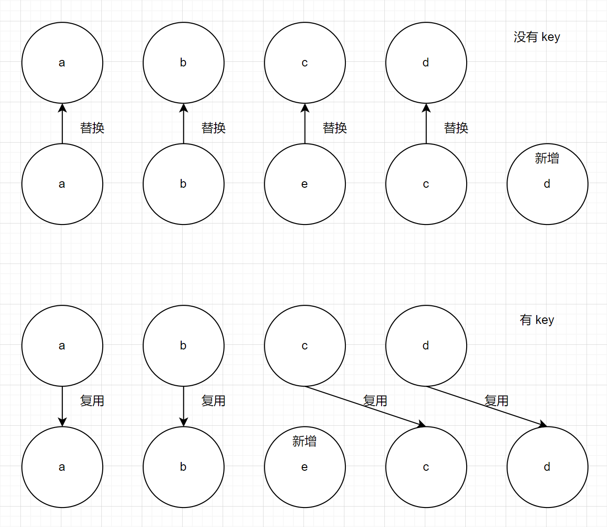
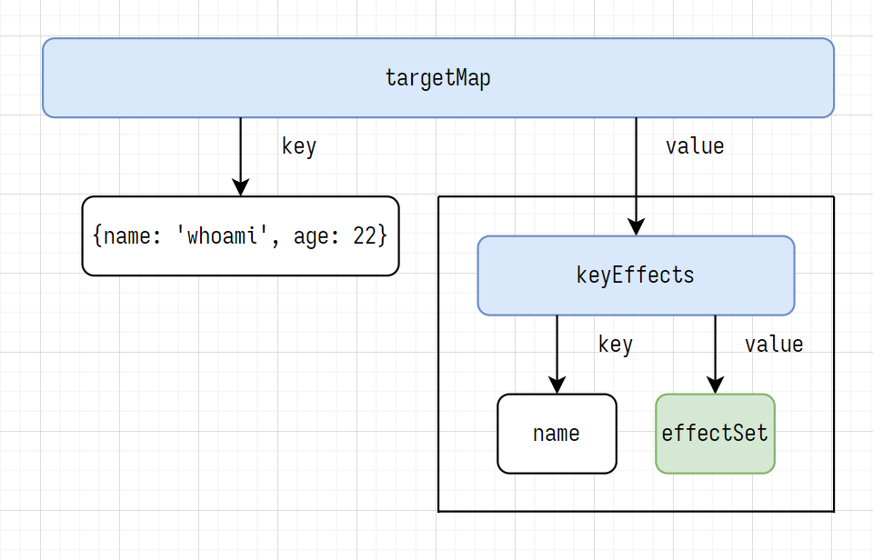
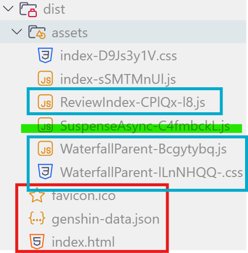

# Vue3 基础

Vue 框架: 单页面应用

MVVM, Model-View-ViewModel 架构

1. View 视图层
2. ViewModel 例 .vue, .jsx, .tsx
3. Model 数据层

## 使用 vscode 调试

```json
// launch.json
{
  "version": "0.2.0",
  "configurations": [
    {
      "type": "chrome",
      "request": "launch",
      "name": "vue3: chrome",
      "url": "http://localhost:5173",
      "webRoot": "${workspaceFolder}/src"
    }
  ]
}
```

## Vue3 新特性

### 重写双向数据绑定

- vue2 的双向数据绑定基于 Object.defineProperty(); 创建一个 Vue 实例时, for..in 遍历 vm.data 中的所有属性, 使用 Object.defineProperty() 将属性转换为 getter 和 setter
- vue3 的双向数据绑定基于 Proxy 代理对象

优势

1. 省略 for..in 遍历
2. 可以监听数组的 length 属性, 数组的索引
3. 可以监听新增属性操作, 删除属性操作

### 优化虚拟 DOM

- Vue2 中, 使用 diff 算法更新虚拟 DOM 时, 全量对比
- Vue3 中, 使用 diff 算法更新虚拟 DOM 时, 只对比有 Patch Flag 的节点

### Vue3 Fragments

Vue3 允许组件有多个根节点, 支持 jsx, tsx

```vue
<template>
  <div>root1</div>
  <div>root2</div>
</template>
```

```jsx
render() {
  return (
    <>
      <div>root1</div>
      <div>root2</div>
    </>
  )
}
```

Vue3 Tree shaking: 删除无用代码

## 创建 Vue3 项目

```bash
pnpm create vite@latest
pnpm create vue@latest # 推荐
```

- public 下的静态文件, 不会被 vite 编译
- src/asset 下的静态文件, 会被 vite 编译
- src/App.vue Vue 应用的根组件
- src/main.ts Vue 应用的入口 JS/TS 文件, 导入 ./App.vue 根组件并创建 App 对象, 并挂载到 index.html, 也可以导入全局样式, 全局 api
- index.html Vue 应用的入口 HTML 文件, `<div id="app"></div>` 是 App 对象的挂载点

## SFC

SFC, Single File Component 单文件组件

对于 .vue 文件

- script 标签: setup 只能有一个, 非 setup 可以有多个
- template 标签: 只能有一个
- style 标签: 可以有多个

> [!TIP]
> 配置 VSCode 代码片段

```json
{
  "Vue3": {
    "prefix": "v3",
    "body": [
      "<script setup lang=\"ts\">",
      "",
      "</script>",
      "",
      "<template>",
      "  <main>",
      "",
      "  </main>",
      "</template>",
      "",
      "<style scoped lang=\"css\">",
      "",
      "</style>"
    ],
    "description": "Snippet (Composition API)"
  }
}
```

## 风格指南

> [!TIP]
> 风格: Vue2 选项式 Option API

```vue
<script lang="ts">
export default {
  data() {
    return {
      cnt: 0,
    };
  },
  methods: {
    addCnt() {
      this.cnt++;
    },
  },
};
</script>
```

> [!TIP]
> 风格: setup 函数

```vue
<script lang="ts">
import { ref } from "vue";

export default {
  setup() {
    const cnt = ref(1);
    const addCnt = () => {
      cnt.value++;
    };
    // 一定要 return
    return {
      cnt,
      addCnt,
    };
  },
};
</script>
```

- 单向绑定: 模型 (数据) 改变 --> 视图 (页面) 改变. 例: {{ }} 插值; v-bind 指令
- 双向绑定: 模型 (数据) 改变 <-> 视图 (页面) 改变. 例: v-model 指令, 常用于输入框

> [!TIP]
> 风格: setup 语法糖, 组合式 Composition API

```vue
<script lang="ts" setup>
import { ref } from "vue";
const cnt = ref(1);
const addCnt = () => {
  cnt.value++;
};
</script>
```

## vue 指令

- v-text 渲染文本, v-text 会覆盖子元素
- v-html 渲染 HTML, v-html 会覆盖子元素, 不支持 Vue 组件
- v-if, v-else-if, v-else 元素的条件渲染, 不渲染则将元素转换为注释节点 `<!-- v-if -->`, 操作 DOM
- v-show 元素的显示/隐藏: 改变内联 CSS 样式 `display: none`, 操作 CSS
- v-on 为元素绑定事件
- v-bind 为元素绑定属性, 模型到视图的单向绑定. v-bind 也可以绑定 style, 类似 jsx
- v-model 模型, 视图的双向绑定, 本质是 v-bind 和 `v-on:[eventType]` 的语法糖
- v-for 遍历元素
- v-once 性能优化, 只渲染一次
- v-memo 性能优化, 缓存

> [!CAUTION]
> v-on 可以简写为 @
>
> v-bind 可以简写为 :
>
> v-model 本质是 v-bind 和 `v-on:[eventType]` 的语法糖

```vue
<template>
  <input v-model="text" />
  <!-- 等价于 -->
  <input v-bind:value="text" @input="text = $event.target.value" />
  <!-- 等价于 -->
  <input :value="text" @input="(ev) => (text = ev.target.value)" />
</template>
```

```vue{20,21,23}
<script lang="ts" setup>
const evType = ref("click");
function clickHandler(ev: Event) {
  console.log("[Child] ev:", ev);
  console.log("[Child] evType:", evType);
}
</script>

<template>
  <!-- 动态事件名 -->
  <!-- ev: PointerEvent -->
  <!-- evType: click -->
  <div
    @click="
      (ev) => {
        console.log('[Parent] ev:', ev);
      }
    "
  >
    <button v-on:[evType]="clickHandler">点击</button>
    <button @[evType]="(ev: Event) => clickHandler(ev)">点击</button>
    <!-- 阻止事件冒泡 -->
    <button @[evType].stop="clickHandler">点击</button>
  </div>
</template>
```

这里, 点击 button 子元素时, 事件会冒泡到 div 父元素, 触发 div 父元素的点击事件, 使用 .stop 修饰符阻止事件冒泡

> [!TIP]
> 事件传播分为 3 个阶段: 捕获阶段, 目标阶段和冒泡阶段

| v-on 指令的修饰符       | 原生 JS                                                                                                                       |
| ----------------------- | ----------------------------------------------------------------------------------------------------------------------------- |
| `v-on:[evType].stop`    | `ev.stopPropagation();` .stop 指令: 阻止事件冒泡                                                                              |
| `v-on:[evType].prevent` | `ev.preventDefault();` .prevent 指令: 阻止事件的默认行为                                                                      |
| `v-on:[evType].capture` | `elem.addEventListener(evType, listener, true /* useCapture */)`.capture 指令: 事件在捕获阶段触发, 而不是在默认的冒泡阶段触发 |
| `v-on:[evType].self`    | .self 指令: 只触发本元素绑定的事件, 不触发从子元素冒泡的事件                                                                  |
| `v-on:[evType].once`    | `elem.removeEventListener(*args)` .once 指令: 事件只触发一次, 触发后移除监听器                                                |
| `@scroll.passive`       | .passive 指令: 对于滚动, 触摸事件, 不调用 `ev.preventDefault()`, 提高流畅度                                                   |
| `@keydown.enter`        | 键修饰符 Key Modifiers: 按 enter 键                                                                                           |
| `@click.ctrl`           | 系统修饰符 System Modifiers: 按 ctrl 键并点击                                                                                 |

```vue{16}
<script lang="ts" setup>
const autofill = ref('')
function enterHandler(ev: Event) {
  console.log('[enterHandler] ev: ', ev)
  console.log('[enterHandler] autofill:', autofill)
  autofill.value = 'Autofill context'
}
</script>

<!-- v-model: 双向绑定 -->
<template>
  <input
    id="text"
    type="text"
    @keydown.enter="enterHandler"
    v-model="autofill"
    placeholder="按 enter 键自动填充"
  />
</template>
```

### Vue3.2 新增 v-memo

v-memo 接收一个依赖项数组, 元素或组件重新渲染时, 如果依赖项数组中的所有元素都未更新, 则跳过渲染, 通常 v-memo 与 v-for 配合使用. 依赖项数组为空时, `v-memo="[]"` 等价于 `v-once`

```vue
<script lang="ts" setup>
const cnt = ref(1);
const cnt2 = ref(1);
const addCnt = () => {
  cnt.value++;
};
const addCnt2 = () => {
  cnt2.value++;
};
</script>

<template>
  <!-- addCnt2 时, 该元素不会重新渲染 -->
  <div v-memo="[cnt]">cnt: {{ cnt }}; cnt2: {{ cnt2 }}</div>
  <button v-on:click="() => addCnt()">addCnt</button>
  <button @click="() => addCnt2()">addCnt2</button>
</template>
```

## 虚拟 DOM 和 diff 算法

```html
<!-- 真实 DOM -->
<div>
  <p></p>
</div>
```

```js
// 虚拟 DOM
import { createElementVNode, openBlock, createElementBlock } from "vue";

export function render(ctx, cache, $props, $setup, $data, $options) {
  return (
    openBlock(), createElementBlock("div", null, [createElementVNode("span")])
  );
}
```

真实 DOM 的属性过多, 操作真实 DOM 浪费性能, 虚拟 DOM 是 JS 对象

```js
const div = document.createElement("div");
let str = "";
for (const key in div) {
  str += key + " ";
}
console.log(str);
```

> [!IMPORTANT]
> diff 算法

- 没有 key: 替换, 新增, 删除性能差
- 有 key: 性能好

vnode: Virtual DOM Node

1. 从头到尾对比 vnode 类型和 key, 不同则 break, 转到 2
2. 从尾到头对比 vnode 类型和 key, 不同则 break, 转到 3
3. 如果旧节点全部 patch, 有多余的新节点, 则挂载
4. 如果新节点全部 patch, 有多余的旧节点, 则卸载
5. 特殊情况: 乱序 (基于[最长递增子序列 LIS](https://leetcode.cn/problems/longest-increasing-subsequence/description/))

原序列 2,3,4,0,6,1 的最长递增子序列为 2,3,4. 将原 vnode 序列的最长递增子序列作为参照序列, 移动不在参照序列中的节点

- 错误实践: 使用索引 index (拼接其他值) 作为 key
- 正确实践: 使用唯一值 id 作为 key

```vue
<script lang="ts" setup>
const arr = ref<string[]>(["a", "b", "c", "d"]);
</script>

<template>
  <!-- eslint-disable-next-line vue/require-v-for-key -->
  <span v-for="val of arr">
    <!-- 没有 key -->
    {{ val }}
  </span>
  <br />

  <span :key="idx" v-for="(val, idx) of arr">
    <!-- 有 key -->
    {{ val }}
  </span>
  <br />

  <button @click="(console.log($event), arr.splice(2, 0, 'e'))">splice</button>
</template>
```



## ref, shallowRef, isRef, triggerRef, customRef

> [!tip]
> Vitest
> `vitest --run --testNamePattern=TestSuiteName.testCaseName <TestFileRelativePath>`
> 检查 -> 设置 -> 偏好设置 -> 控制台 -> 自定义格式设置工具

回顾 Vue2

```ts
export default {
  data() {
    return {
      // 响应式对象
      age: 22,
    };
  },
};
```

- ref 深层响应式
- shallowRef 浅层响应式
- isRef 判断是否为使用 ref, shallowRef 创建的响应式对象
  - `isRef(refObj), isRef(shallowRefObj)` 返回 true
  - `isRef(reactiveObj), isRef(shallowReactiveObj)` 返回 false
- triggerRef 调用 triggerRef 强制触发深度响应式, `shallowRef + triggerRef` 等价于 `ref`

同时使用 ref/reactive 和 shallowRef/shallowReactive 时, shallowRef/shallowReactive 会表现的像深层响应式

> [!caution]
> Vue 组件的 ref/reactive 依赖改变时, 会更新整个 template [vuejs/core #10680](https://github.com/vuejs/core/issues/10680)

```js
class RefImpl {
  set value(newVal) {
    // ...
    triggerRefValue(this, newVal); // 触发深度响应式
  }

  export function triggerRef(ref: Ref) {
    triggerRefValue(...args); // 触发深度响应式
  }
}
```

### ref 绑定 DOM 元素

```vue
<script lang="ts" setup>
const divRef = ref<HTMLDivElement>();
onMounted(() => {
  console.log(divRef.value?.innerText);
});
</script>

<template>
  <div ref="divRef">ref 绑定 DOM 元素</div>
</template>
```

### customRef

```ts
function customRefFactory<T>(val: T, timeout: number) {
  let timer: any;
  const myRef: ReturnType<typeof customRef> = customRef(
    (
      track: () => void /** 收集依赖 */,
      trigger: () => void /** 触发更新 */,
    ) => {
      return {
        get: () => {
          track();
          return val;
        },
        set: (newVal: T) => {
          clearTimeout(timer);
          timer = setTimeout(() => {
            val = newVal;
            trigger();
            timer = null;
          }, timeout);
        },
      };
    },
  );
  return myRef;
}
```

## reactive, shallowReactive

reactive 返回一个代理对象, 不能对该代理对象 itemsProxy 直接赋值, 否则会失去响应式

- ref 可以用于引用数据类型, 也可以用于基本数据类型; reactive 只能用于引用数据类型
- ref 访问, 修改响应式对象的值时需要加 .value; reactive 不需要
- ref 更适合简单类型; reactive 更适合复杂类型

- reactive 深层响应式
- shallowReactive 浅层响应式

同时使用 ref/reactive 和 shallowRef/shallowReactive 时, shallowRef/shallowReactive 会表现的像深层响应式

## readonly

返回一个只读的响应式对象

```ts
const itemsProxy = reactive<string[]>([]);
const readonlyItemsProxy = readonly(itemsProxy);
readonlyItemsProxy.push("item");
// Reactive<Array(0)>
// Reactive<Array(0)> (readonly)
console.log(itemsProxy, readonlyItemsProxy);
itemsProxy.push("item");
// Reactive<Array(1)>
// Reactive<Array(1)> (readonly)
console.log(itemsProxy, readonlyItemsProxy);
```

## toRef, toRefs, toRaw

- toRef, toRefs 将 refObj.value 或 reactiveObj 的属性转换为响应式对象
- 直接解构会失去响应式, 使用 toRefs 解构可以保留响应式
- toRaw: 将 refObj.value 或 reactiveObj 转换为普通对象

```vue
<script lang="ts" setup>
const obj = { name: "whoami", age: 1 };
// 错误实践: toRef, toRefs 一个普通对象
const age = toRef(obj /** 对象 */, "age" /** 对象的 key */);

const obj2 = ref({ name: "whoami2", age: 2 });
const _age2 = toRef(obj2.value, "age");
const { name: name2, age: age2 } = toRefs(obj2.value);

const obj3 = reactive({ name: "whoami3", age: 3 });
const _age3 = toRef(obj3, "age");
const { name: name3, age: age3 } = toRefs(obj3);

// {name: 'whoami', age: 1} {name: 'whoami', age: 1}
console.log(obj, toRaw(obj));
// Ref<Object> Reactive<Object> {name: 'whoami2', age: 2}
console.log(obj2, obj2.value, toRaw(obj2.value));
// Reactive<Object> {name: 'whoami3', age: 3}
console.log(obj3, toRaw(obj3));
</script>

<template>
  <!-- 错误实践: toRef, toRefs 一个普通对象,
   响应式对象 age 值更新, 视图不会更新 (没有 track, trigger)  -->
  <p>{{ obj }}</p>
  <p>{{ age }}</p>

  <!-- toRef, toRefs 一个 ref/reactive 对象,
   响应式对象 name2, _age2, age 值更新, 视图也会更新 (有 track, trigger)   -->
  <p>{{ obj2 }}</p>
  <p>{{ `${name2} ${_age2} ${age2}` }}</p>
  <p>{{ obj3 }}</p>
  <p>{{ `${name3} ${_age3} ${age3}` }}</p>
</template>
```

> [!tip]
>
> `get value() { track(); /** 跟踪依赖 */}` 和 `set value(newVal) { trigger(); /** 触发更新 */}` 以更新视图

## 响应式原理



## computed 计算属性

- 计算属性 `computed({ getter, setter })`
- 只读的计算属性 `computed(getter)`
- 计算属性 computed(getter) 会缓存计算结果, 只有依赖项更新时, 才会重新计算 (脏值检测)
- 直接调用 getter 不会缓存计算结果, 每次重新渲染 template 时, 都会重新计算

```ts
const firstName = ref("Tiancheng");
const lastName = ref("Hang");
const fullName = computed<string>({
  get() {
    return firstName.value + "-" + lastName.value;
  },
  set(newVal: string) {
    [firstName.value, lastName.value] = newVal.split("-");
  },
});

const readonlyFullName = computed<string>(
  () => firstName.value + "- " + lastName.value,
);
```

## watch 侦听器

### watch

1. 侦听 ref 创建的响应式对象, 默认浅层侦听 (侦听原始值的地址, deep: false 或 deep: 0)
   - `deep: true` 开启深层侦听, 性能很差
   - deep 也可以是一个数字, 表示最大侦听深度
   - 默认 `deep: 0`, 表示侦听原始值的地址 (即 .value 这一层)
   - `deep: 1`, 表示最大侦听深度为 1 (即 .value.propName 这一层)
2. 侦听 reactive 创建的响应式对象, 默认开启深度侦听 (deep: true), 性能很差
3. 当原始值的地址没有改变时, 回调函数中 newVal === oldVal === 当前响应式对象的值 (ref.value, reactive)
4. 可以通过传递一个 getter, 侦听 reactive 创建的响应式对象中指定的属性
5. 回调函数的参数 newVal, oldVal; 可选参数 onCleanup, 先执行, 等价于 `onWatcherCleanup`
6. 回调函数默认懒执行
   - 默认 `immediate: false`, 即懒执行 callback
   - `immediate: true`, 即立即执行 callback, 此时 oldVal === undefined
7. options
   - deep 见 1
   - immediate 见 6
   - flush
     - 默认 `flush: 'pre'` 组件挂载/更新前触发 callback
     - `flush: 'sync'` 同步触发 callback
     - `flush: 'post'` 组件挂载/更新后触发 callback
   - `once: true` 一次性侦听器, callback 只触发一次
   - 调试选项 onTrigger, onTrack 例 `onTrigger(ev) { debugger }`
8. watch 可以返回停止侦听的函数

[WatchDemo](https://github.com/161043261/type/blob/main/awesome/vue-third/src/components/WatchDemo.vue)

### watchEffect

1. watchEffect 只能浅层侦听
2. watchEffect 自动侦听 (自动跟踪回调函数中的响应式依赖), 不需要指定 sources
3. 可以指定侦听的深层属性 `ref.value.propName; reactive.propName`, 模拟深层侦听
4. 回调函数的可选参数 onCleanup, 先执行, 等价于 `onWatcherCleanup`
5. 回调函数默认立即执行
6. options
   - flush: 同 watch
   - 调试选项 onTrigger, onTrack: 同 watch
7. watchEffect 可以返回停止侦听的函数 unwatch

[WatchEffectDemo](https://github.com/161043261/type/blob/main/awesome/vue-third/src/components/WatchEffectDemo.vue)

总结: 未指定 deep 时, 地址改变则可以侦听到, 地址未改变则侦听不到

## 生命周期

setup 语法糖中, 将 beforeCreate, created 合并为 setup `onXxx(() => { /** ... */ })`

1. setup 创建阶段
2. onBeforeMount 挂载前, 获取不到 DOM
3. onMounted 挂载后, 可以获取到 DOM
4. onRenderTriggered 触发更新后, 回调函数中可以传递一个事件对象, 可以同时获取到 newValue 和 oldValue, 调试用 hook, 不属于组件生命周期
5. onBeforeUpdate 更新前, 获取的是 oldValue
6. onRenderTracked 跟踪依赖后, 回调函数中可以传递一个事件对象, 只能获取到 newValue, 调试用 hook, 不属于组件生命周期
7. onUpdated 更新后, 获取的是 newValue
8. onBeforeUnmount 卸载前, 可以获取到 DOM
9. onUnmounted 卸载后, 获取不到 DOM

## 父子组件传参

> [!warning]
>
> - 可以通过 $attrs 或 useAttrs() 获取组件上的所有属性
> - 可以通过 $refs 获取引用的所有子组件暴露的接口的集合
> - 可以通过 $parent 获取父组件暴露的接口

### 父传子

> [!tip]
> 子组件中使用宏函数 defineProps 定义自定义属性

父组件

```vue
<script lang="ts" setup>
// 父子组件传参
const refStr_ = ref("Reactive Str From Parent");
const reactiveArr_ = reactive([6, 6, 6]);
</script>

<template>
  <!-- str 使用默认值 -->
  <ChildDemo :refStr="refStr_" :reactiveArr="reactiveArr_" />
  <ChildDemo
    str="Str From Parent"
    :refStr="refStr_"
    :reactiveArr="reactiveArr_"
  />
  <!-- 是响应式的 -->
  <button @click="refStr_ += '!'">changeRefStr</button>
  <button @click="reactiveArr_.push(6)">changeReactiveArr</button>
</template>
```

子组件

:::code-group

```vue{2} [写法 1]
<script lang="ts" setup>
const props = defineProps(["str", "refStr", "reactiveArr"]);
console.log(props.str, props.refStr, props.reactiveArr);
</script>

<template>
  <ul>
    <!-- template 中, 使用 props.propName 或直接使用 propName 都可以 -->
    <li>str: {{ props.str }}</li>
    <li>refStr: {{ refStr }}</li>
    <li>reactiveArr: {{ reactiveArr }}</li>
  </ul>
</template>
```

```vue{2-15} [写法 2]
<script lang="ts" setup>
const props = defineProps({
  str: {
    type: String,
    default: "Default str",
  },
  refStr: {
    type: String,
    default: "Default refStr",
  },
  reactiveArr: {
    type: Array<number>, // Array
    default: () => [1, 2, 3], // 引用类型必须转换为箭头函数
  },
});
console.log(props.str, props.refStr, props.reactiveArr);
</script>
```

```vue{2-6} [写法 3]
<script lang="ts" setup>
const props = defineProps<{
  str?: string;
  refStr?: string;
  reactiveArr?: number[];
}>();
console.log(props.str, props.refStr, props.reactiveArr);
</script>
```

```vue{2-13} [写法 4]
<script lang="ts" setup>
const props = withDefaults(
  defineProps<{
    str?: string;
    refStr?: string;
    reactiveArr?: number[];
  }>(),
  {
    str: "Default str",
    refStr: "Default refStr",
    reactiveArr: () => [1, 2, 3], // 引用类型必须转换为箭头函数
  }
);
console.log(props.str, props.refStr, props.reactiveArr);
</script>
```

:::

### Grandparent 传 Child

可以通过 `$attrs` 或 `useAttrs()` 获取组件上的所有属性

::: code-group

```vue [GrandparentDemo]
<script lang="ts" setup>
const a = ref(1);
const b = reactive({ v: 2 });
function addA(da: number) {
  a.value += da;
}
</script>

<template>
  <div>
    <h1>$attrs, useAttrs</h1>
    <!-- v-bind="{ p1: "v1", p2: "v2" }" 等价于 :p1="v1" :p2="v2" -->
    <ParentDemo
      :a="a"
      :b="b"
      :addA="addA"
      :="{ p1: 'v1', p2: 'v2' }"
    ></ParentDemo>
  </div>
</template>
```

```vue [ParentDemo]
<script lang="ts" setup>
const attrs = useAttrs();
</script>

<template>
  <div>
    <div>$attrs: {{ $attrs }}</div>
    <!-- $attrs === attrs: false -->
    <div>attrs: {{ attrs }}, $attrs === attrs: {{ $attrs === attrs }}</div>
    <ChildDemo :="$attrs"></ChildDemo>
    <ChildDemo :="attrs"></ChildDemo>
  </div>
</template>
```

```vue [ChildDemo]
<script lang="ts" setup>
defineProps(["a", "b", "addA", "p1", "p2"]);
</script>

<template>
  <div>
    <p>a={{ a }} b={{ b }} p1={{ p1 }} p2={{ p2 }}</p>
    <button @click="addA(1)">Add grandparent's a</button>
  </div>
</template>
```

:::

### 子传父

> [!tip]
>
> 1. 子组件中使用 defineEmits 定义自定义事件
> 2. 子组件触发自定义事件, 向父组件发射参数
> 3. 父组件中, 为子组件的自定义事件绑定回调函数, 接收自定义事件发生时, 子组件发射的参数

子组件

::: code-group

```vue{3} [写法 1]
<script lang="ts" setup>
// 自定义事件名 evName, evName2 会被自动转换为 ev-name, ev-name2
const emit = defineEmits(["evName", "evName2"]);

function txToParent(ev: Event) {
  emit('evName', ev)
}
function txToParent2() {
  emit('evName2', 'foo', 'bar')
}
</script>

<template>
  <button @click="(ev) => txToParent(ev)">子传父</button>
  <button @click="txToParent2">子传父2</button>
</template>
```

```vue{3-6} [写法 2]
<script lang="ts" setup>
// 自定义事件名 evName, evName2 会被自动转换为 ev-name, ev-name2
const emit = defineEmits<{
  (e: 'evName', arg: Event): void, // 范型中必须使用 : 不能使用 =>
  (e: 'evName2', arg: string, arg2: string): void
}>()

function txToParent(ev: Event) {
  emit('evName', ev)
}
function txToParent2() {
  emit('evName2', 'foo', 'bar')
}
</script>

<template>
  <button @click="(ev) => txToParent(ev)">子传父</button>
  <button @click="txToParent2">子传父2</button>
</template>
```

```vue{3-6} [写法 3]
<script lang="ts" setup>
// 自定义事件名 evName, evName2 会被自动转换为 ev-name, ev-name2
const emit = defineEmits<{
  evName: [arg: Event],
  evName2: [arg: string, arg2: string]
}>()

function txToParent(ev: Event) {
  emit('evName', ev)
}
function txToParent2() {
  emit('evName2', 'foo', 'bar')
}
</script>

<template>
  <button @click="(ev) => txToParent(ev)">子传父</button>
  <button @click="txToParent2">子传父2</button>
</template>
```

:::

父组件

```vue
<script lang="ts" setup>
// 子传父
function rxFromChild(...args: any[]) {
  console.log(args);
}
</script>

<template>
  <ChildDemo
    @ev-name="(...args) => rxFromChild(args)"
    @ev-name2="rxFromChild"
  ></ChildDemo>
</template>
```

### 组件暴露接口

> [!tip]
> 子组件使用 defineExpose 暴露接口, 包括属性和方法

::: code-group

```vue [子组件]
<script lang="ts" setup>
defineExpose({
  name: "Tiancheng",
  getAge() {
    return 23;
  },
});
</script>
```

```vue [父组件]
<script lang="ts" setup>
const refName = ref<InstanceType<typeof DefineExposeDemo>>();
onMounted(() => {
  console.log("[defineExpose]", refName.value?.name, refName.value?.getAge());
});
</script>

<template>
  <DefineExposeDemo ref="refName" />
</template>
```

:::

- 可以通过 `$refs` 获取引用的所有子组件暴露的接口的集合 `$refs = { refName: { prop: val } }`
- 可以通过 `$parent` 获取父组件暴露的接口 `$parent = { prop: val }`

::: code-group

```vue{7} [Girl]
<script lang="ts" setup>
let toy = ref("SnowWhite");
let age = ref(3);

defineExpose({ toy, age });

// $parent Proxy{ age }
function subAge(parent: any) {
  parent.age--;
}
</script>

<template>
  <button @click="subAge($parent)">parent.age--</button>
</template>
```

```vue{7} [Boy]
<script lang="ts" setup>
let computer = ref("Lenovo");
let age = ref(5);

defineExpose({ computer, age });

// $parent Proxy{ age }
function addAge(parent: any) {
  parent.age++;
}
</script>

<template>
  <button @click="addAge($parent)">parent.age++</button>
</template>
```

```vue{14} [Parent]
<script lang="ts" setup>
let age = ref(35);
let girlInstance: Ref<any> = ref();
let boyInstance: Ref<any> = ref();

function changeToy() {
  girlInstance.value.toy += "!";
}

function changeComputer() {
  boyInstance.value.computer += "!";
}

// $refs: Proxy{ girlInstance: { age, toy }, boyInstance: { age, computer } }
function addAge(refs: { [key: string]: any }) {
  for (let prop in refs) {
    console.log(prop); // boyInstance, girlInstance
    refs[prop].age++;
  }
}

defineExpose({ age });
</script>

<template>
  <div class="parent">
    <button @click="changeToy">change girl's toy</button>
    <button @click="changeComputer">change boy's computer</button>
    <!-- $refs -->
    <button @click="addAge($refs)">children.age++</button>
    <Girl ref="girlInstance" />
    <Boy ref="boyInstance" />
  </div>
</template>
```

:::

> [!caution]
> 宏函数
>
> 1. 宏函数只能在 setup 代码块中使用
> 2. 宏函数不需要显式导入
> 3. 宏函数 defineProps 编译时执行, 编译为组件的 props

经典错误

```vue
<script lang="ts" setup>
const { list } = toRefs(defineProps<{ list: { h: number; bg: string }[] }>());
console.log(list.value);
</script>
```

## 全局组件, 局部组件, 递归组件

### 局部组件

- 在 XxxYxx.vue 中 import 导入的组件, 默认是局部组件
- 在 main.ts 中 import 导入的组件, 注册为是全局组件 (全局导入)

```ts
// main.ts
import GlobalComponent from "./components/example/GlobalComponent.vue";
const app = createApp(App);
app.component("CardComponent", GlobalComponent); // 注册为 CardComponent 全局组件
```

批量注册全局组件

```ts
// main.ts
import * as GlobalComponents from "./components/global";

const app = createApp(App);
for (const [key, component] of Object.entries(GlobalComponents)) {
  app.component(key, component);
}
```

### 递归组件

父组件 RecursiveParent.vue

```vue
<script lang="ts" setup>
const data = reactive<TreeNode[]>([
  { name: "1", checked: false },
  { name: "2", checked: false, children: [{ name: "2.1", checked: false }] },
  {
    name: "3",
    checked: false,
    children: [
      {
        name: "3.1",
        checked: false,
        children: [{ name: "3.1.1", checked: false }],
      },
    ],
  },
]);
</script>

<template>
  <div>
    <RecursiveChild :data="data"></RecursiveChild>
  </div>
</template>
```

递归子组件 RecursiveChild.vue

```vue
<script lang="ts">
export default {
  name: "RecursiveChild", // 也可以自定义组件名
};
</script>

<script lang="ts" setup>
defineProps<{
  data?: TreeNode[]; // template 中可以直接使用 data
}>();
</script>

<template>
  <div>
    <div v-for="(item, idx) of data" :key="idx">
      <div>
        <input type="checkbox" v-model="item.checked" />
        <span>{{ item.name }}</span>
      </div>
      <!-- 递归组件, 默认组件名等于文件名 -->
      <RecursiveChild
        v-if="item.children?.length"
        :data="item.children"
      ></RecursiveChild>
    </div>
  </div>
</template>
```

### defineOptions 宏函数

[Vue Macro](https://vue-macros.dev/zh-CN/)

> [!caution]
>
> 1. Vue3.3+ 已内置 defineOptions 宏函数, 可以直接使用
> 2. 不能同时使用 defineOptions 宏函数和 export default 默认导出

```bash
pnpm i unplugin-vue-define-options
```

vite.config.ts 中使用 unplugin-vue-define-options 插件

```ts
import defineOptions from "unplugin-vue-define-options/vite";
// https://vite.dev/config/
export default defineConfig({
  plugins: [vue(), vueJsx(), vueDevTools(), defineOptions()],
});
```

tsconfig.json 中, 包括插件的 .d.ts 类型声明文件

```json
{
  "compilerOptions": {
    "types": ["unplugin-vue-define-options/macros-global"]
  }
}
```

现在可以使用 defineOptions 宏函数自定义组件名 (Vue3.3+ 已内置 defineOptions 宏函数, 可以直接使用)

```ts
// unplugin-vue-define-options
defineOptions({
  name: "RecursiveChild",
});
```

> [!warning]
> 使用递归组件时, 需要阻止事件冒泡 (使用 .stop 修饰符)

```vue
<script lang="ts" setup>
defineProps<{
  data?: TreeNode[]; // template 中可以直接使用 data
}>();

function clickTap(item: TreeNode) {
  console.log(item);
}
</script>

<template>
  <div>
    <div @click="clickTap(item)" v-for="(item, idx) of data" :key="idx"> // [!code --]
      <!-- .stop 修饰符: 阻止事件冒泡 -->
    <div @click.stop="clickTap(item)" v-for="(item, idx) of data" :key="idx"> // [!code ++]
      <div>
        <input type="checkbox" v-model="item.checked" />
        <span>{{ item.name }}</span>
      </div>
      <RecursiveChild v-if="item.children?.length" :data="item.children"></RecursiveChild>
    </div>
  </div>
</template>
```

## 动态组件

多个组件使用同一个挂载点, 并可以动态切换

动态组件的应用场景: tab 页切换

### `<component :is="shallowRefComponent"></component>`

不要创建组件的 ref 对象, 使用 markRaw 标记组件, 或使用 shallowRef 代替 ref 避免不必要的性能开销

::: code-group

```vue [写法 1]
<script lang="ts" setup>
import DynamicA from "./DynamicA.vue";
import DynamicB from "./DynamicB.vue";
import DynamicC from "./DynamicC.vue";
const active = ref(0);
// 不要创建组件的 ref 对象, 使用 markRaw 标记组件, 或使用 shallowRef 代替 ref 避免不必要的性能开销
// const dynamicItem = ref(DynamicA) [!code --]
const dynamicItem = shallowRef<typeof DynamicA>(DynamicA);

function onClick(com: typeof DynamicA, idx: number) {
  active.value = idx;
  dynamicItem.value = com;
}
const items = reactive([
  { name: "TabA", onClick: (idx: number) => onClick(DynamicA, idx) },
  { name: "TabB", onClick: (idx: number) => onClick(DynamicB, idx) },
  // markRaw 设置 __skip__ = true, 跳过 proxy 代理, 这里是可选的
  { name: "TabC", onClick: (idx: number) => onClick(markRaw(DynamicC), idx) },
]);
</script>

<template>
  <div style="display: flex">
    <!-- 同时有静态 class 和 动态 :class 时, 动态 :class 必须是一个类名数组 -->
    <div
      class="tab"
      :class="[active === idx ? 'active' : '']"
      v-for="(item, idx) of items"
      :key="idx"
    >
      <div @click="((active = idx), item.onClick())">{{ item.name }}</div>
    </div>
  </div>
  <component :is="dynamicItem"></component>
</template>
```

```vue [写法 2]
<script lang="ts" setup>
const active = ref(0);

function onClick(com: string, idx: number) {
  active.value = idx;
  dynamicItem.value = com;
}

const items = reactive([
  { name: "TabA", onClick: (idx: number) => onClick("DynamicA", idx) }, // 使用组件名
  { name: "TabB", onClick: (idx: number) => onClick("DynamicB", idx) },
  { name: "TabC", onClick: (idx: number) => onClick("DynamicC", idx) },
]);
</script>

<script lang="ts">
import DynamicA from "./DynamicA.vue";
import DynamicB from "./DynamicB.vue";
import DynamicC from "./DynamicC.vue";

export default {
  // 注册子组件
  components: {
    DynamicA: DynamicA,
    DynamicB /** DynamicB: DynamicB */,
    DynamicC,
  },
};
</script>
```

```vue [写法 3]
<script lang="ts" setup>
import DynamicA from "./DynamicA.vue";
import DynamicB from "./DynamicB.vue";
import DynamicC from "./DynamicC.vue";

defineOptions({
  // 注册子组件
  components: {
    DynamicA: DynamicA,
    DynamicB,
    DynamicC,
  },
});

const dynamicItem = shallowRef<string>("DynamicA");

function onClick(com: string, idx: number) {
  active.value = idx;
  dynamicItem.value = com;
}

const items = reactive([
  { name: "TabA", onClick: (idx: number) => onClick("DynamicA", idx) }, // 使用组件名
  { name: "TabB", onClick: (idx: number) => onClick("DynamicB", idx) },
  { name: "TabC", onClick: (idx: number) => onClick("DynamicC", idx) },
]);
</script>
```

:::

## 插槽 slot

插槽: **子组件**提供给**父组件**的占位符, 可以插入父组件的 template

1. 匿名插槽 default
2. 具名插槽
3. 作用域插槽
4. 动态插槽

::: code-group

```vue{18} [子组件]
<script lang="ts" setup>
const items = reactive([
  { name: 'foo', age: 1 },
  { name: 'bar', age: 2 },
  { name: 'baz', age: 3 },
])
</script>

<template>
  <div>
    <header>
      <!-- 匿名插槽 -->
      <slot>匿名插槽</slot>
    </header>
    <main>
      <div v-for="(item, idx) of items" :key="idx">
        <!-- 作用域插槽 -->
        <slot name="main" :item="item" :idx="idx">作用域插槽</slot>
      </div>
    </main>
    <footer>
      <!-- 具名插槽 -->
      <slot name="footer">具名插槽</slot>
    </footer>
  </div>
</template>
```

```vue{14} [父组件]
<script lang="ts" setup>
import SlotChild from "./SlotChild.vue";
</script>

<template>
  <div>
    <!-- 子组件 -->
    <SlotChild>
      <!-- <div>默认插入到子组件的匿名插槽</div> -->
      <template v-slot:default>
        <div>插入到子组件的匿名插槽 default</div>
      </template>

      <template v-slot:main="{ item, idx }">
        <div>插入到子组件的作用域插槽 main</div>
        <div>{{ `idx: ${idx}, name: ${item.name}, age: ${item.age}` }}</div>
      </template>

      <template #footer>
        <div>插入到子组件的具名插槽 footer, v-slot 等价于 #</div>
      </template>
    </SlotChild>
  </div>
</template>
```

```vue [动态插槽]
<script lang="ts" setup>
import SlotChild from "./SlotChild.vue";

const slotName = ref("default");
</script>

<template>
  <div>
    <SlotChild>
      <!-- 动态插槽, 等价于 #[slotName] -->
      <template v-slot:[slotName]>
        <div>Dynamic Slot</div>
      </template>
    </SlotChild>
    <button @click="slotName = 'default'">default</button>
    <button @click="slotName = 'main'">main</button>
    <button @click="slotName = 'footer'">footer</button>
  </div>
</template>
```

:::

## 异步组件 Suspense

1. 有异步 setup 钩子的组件: setup 语法糖中使用顶层 await, 会编译为 `async setup()`
2. Suspense 等待: 有异步 setup 钩子的组件, 或使用 defineAsyncComponent 定义的异步组件
3. Suspense 组件有两个插槽: #default 和 #fallback, 两个插槽都只允许一个直接子节点, 尽可能显示 #default 插槽中的节点, 否则显示 #fallback 插槽中的节点

`xhr.readyState`

1. 未调用 send 方法
2. 正在执行 send 方法
3. send 方法执行完成
4. 正在解析响应
5. 响应解析完成

::: code-group

```ts [axios.ts]
// 原生 AJAX
export const myAxios = {
  get<T>(url: string): Promise<T> {
    return new Promise((resolve) => {
      const xhr = new XMLHttpRequest();
      xhr.open("GET", url);
      xhr.onreadystatechange = () => {
        if (xhr.readyState === 4 && xhr.status === 200) {
          setTimeout(() => {
            resolve(JSON.parse(xhr.responseText));
          }, 3000);
        }
      };
      xhr.send(null);
    });
  },
};
```

```vue [SuspenseAsync]
<script lang="ts" setup>
import { myAxios } from "@/utils/axios.ts";
// setup 语法糖中使用顶层 await, 会编译为 async setup()
const {
  characters: [albedo],
} = await myAxios.get<{ characters: Array<any> }>("./genshin-data.json");
</script>

<template>
  <em>Suspense Async</em>
  <div>name: {{ albedo.name }}</div>
  <div>description: {{ albedo.description }}</div>
</template>
```

```vue [SuspenseSkeleton]
<template>
  <em>Suspense Skeleton</em>
  <div>请求中...</div>
</template>
```

```vue [App]
<script lang="ts" setup>
import SuspenseSkeleton from "./components/SuspenseSkeleton.vue";
// 使用 defineAsyncComponent 定义的异步组件
const SuspenseAsync = defineAsyncComponent(
  () => import("./components/SuspenseAsync.vue"),
);
</script>

<template>
  <Suspense>
    <template #default>
      <SuspenseAsync />
    </template>
    <template v-slot:fallback>
      <SuspenseSkeleton />
    </template>
  </Suspense>
</template>
```

:::

### defineAsyncComponent

::: code-group

```ts
const SuspenseAsync = defineAsyncComponent(
  () => import("./components/SuspenseAsync.vue"),
);
```



- 红色: public 目录下, 不打包
- 蓝色: 异步导入的路由组件, 分开打包
- 绿色: 异步组件, 分开打包, 懒加载

## Teleport 传送模板

Teleport 将部分 template 传送到指定元素下, 成为指定元素的「直接子元素」

:::code-group

```vue [script]
<script lang="ts" setup>
const showPopup = ref(false);
const showPopup2 = ref(false);
</script>
```

```vue [template]
<template>
  <button @click="showPopup = true">
    显示弹窗 (Teleport + absolute 绝对定位)
  </button>
  <button @click="showPopup2 = true">显示弹窗2 (fixed 固定定位)</button>

  <!-- popup 是 body 的直接子元素 -->
  <Teleport to="body" :disabled="false">
    <!-- to="选择器" -->
    <!-- disable 是否禁用 Teleport 传送 -->
    <div class="popup" v-show="showPopup">
      <button @click="showPopup = false">隐藏弹窗</button>
    </div>
    <div>我也是 body 的直接子元素</div>
  </Teleport>

  <!-- popup2 是 #app 的直接子元素 -->
  <div class="popup2" v-show="showPopup2">
    <button @click="showPopup2 = false">隐藏弹窗2</button>
  </div>
</template>
```

```vue [style]
<style lang="css" scoped>
/** 如果没有 relative 相对定位的父元素, 则 absolute 绝对定位参考 body 元素定位 */
/** 如果有 relative 相对定位的父元素, 则 absolute 绝对定位参考该父元素 */
/** fixed 固定定位, 参考视口; relative 相对定位, 参考原位置 */
/** 解决 1: absolute 绝对定位, 并使用 Teleport 将部分 template 传送到 body 元素下 */
/** 解决 2: fixed 固定定位 (实际上更好) */
.popup {
  position: absolute;
  background: lightblue;
}

.popup2 {
  position: fixed;
  background: lightpink;
}
</style>
```

:::

## 依赖注入 provide/inject

类似的技术: IOC/DI

**IoC, Inversion of Control**: 不自己 new 对象, 或依赖低层的对象 (即高层 user.controller.ts 中 `import { userService } from './user.service.ts'` 导入底层 user.service.ts 中的对象), 而是从容器中取对象

**DI, Dependency Injection**: 不导出对象 `export userService`, 而是将对象放入容器中

provide/inject: 祖先 provide 给后代, 后代 inject 到祖先, 实现祖孙传参

::: code-group

```vue [GrandparentProvide]
<script lang="ts" setup>
const colorVal = ref("lightpink");
provide("colorKey" /** key */, colorVal /** value */);
// 也可以提供一个 readonly 的 colorVal, 防止子组件修改
// provide('colorKey', readonly(colorVal))
</script>

<template>
  <div>
    <InjectToParent></InjectToParent>
  </div>
</template>
```

```vue [InjectToParent]
<script lang="ts" setup>
const injectedColor = inject<Ref<string>>("colorKey");
</script>

<template>
  <div>
    <InjectToChild></InjectToChild>
  </div>
</template>
```

```vue [InjectToChild]
<script lang="ts" setup>
const injectedColor = inject<Ref<string>>(
  "colorKey",
  ref("lightyellow") /** defaultVal */,
);
</script>

<template>
  <div>
    <button @click="injectedColor = 'lightyellow'">
      Child 修改 Grandparent 注入的颜色
    </button>
  </div>
</template>
```

## 兄弟组件通信

### 方式 1: 通过父组件桥接

通过父组件桥接, 实现兄弟组件通信 (BoyDemo -> ParentBridge -> GirlDemo)

::: code-group

```vue [BoyDemo]
<!-- Boy 组件使用 defineEmits 定义自定义事件 -->
<script lang="ts" setup>
// const emit = defineEmits(['customEvent'])
const emit = defineEmits<{
  customEvent: [flag: boolean, timeStr: string]; // 具名元组
}>();

let flag = false;
function emitArgs() {
  flag = !flag;
  emit("customEvent", flag, new Date().toLocaleTimeString());
}
</script>

<template>
  <div>
    <!-- 点击按钮以触发自定义事件, 向父组件发射参数 -->
    <button @click="emitArgs">emitArgs</button>
  </div>
</template>
```

```vue [ParentBridge]
<!-- 父组件中, 为 Boy 组件的自定义事件绑定回调函数,
自定义事件发生时, 接收 Boy 组件发射的参数 -->
<script lang="ts" setup>
const flag = ref<boolean>(false);
const timeStr = ref<string>("方式 1: 通过父组件桥接, 实现兄弟组件通信");

function rxArgs(flag_: boolean, timeStr_: string) {
  flag.value = flag_;
  timeStr.value = timeStr_;
}
</script>

<template>
  <div>
    <BoyDemo
      @custom-event="(flag: boolean, timeStr: string) => rxArgs(flag, timeStr)"
    />
    <!-- 将 Boy 组件发射的参数, 绑定到 Girl 组件的自定义属性 -->
    <GirlDemo :flag="flag" :timeStr="timeStr" />
  </div>
</template>
```

```vue [GirlDemo]
<!-- Girl 组件使用 defineProps 定义自定义属性 -->
<script lang="ts" setup>
defineProps<{
  flag: boolean;
  timeStr: string;
}>();
</script>

<template>
  <div>
    <div>flag: {{ flag }}</div>
    <div>timeStr: {{ timeStr }}</div>
  </div>
</template>
```

:::

### 方式 2: 事件总线 (手写发布/订阅 pub/sub)

BusBoy 发布, BusGirl 订阅, 不需要父组件参与

::: code-group

```vue [BusBoy]
<script lang="ts" setup>
import bus from "./bus";

let flag = false;
function emitArgs() {
  flag = !flag;
  bus.publish("customEvent", flag, new Date().toLocaleTimeString()); // 发布
}
</script>

<template>
  <div>
    <button @click="emitArgs">emitArgs</button>
  </div>
</template>
```

```vue [BusGirl]
<script lang="ts" setup>
import bus from "./bus";

const flag = ref(false);
const timeStr = ref("方式 2: 事件总线 (手写发布/订阅 pub/sub)");

bus.subscribe("customEvent", (flag_: boolean, timeStr_: string) => {
  flag.value = flag_;
  timeStr.value = timeStr_;
});
</script>

<template>
  <div>
    <div>flag: {{ flag }}</div>
    <div>timeStr: {{ timeStr }}</div>
  </div>
</template>
```

```ts [事件总线]
type IBus = {
  publish: (eventType: string) => void;
  subscribe: (eventType: string, callback: Function) => void;
};

type TEvName2cbs = {
  [key: string | number | symbol]: Array<Function>;
};

class Bus implements IBus {
  evName2cbs: TEvName2cbs;
  constructor() {
    this.evName2cbs = {};
  }
  // 发布 publish
  publish(eventType: string, ...args: any[]): void {
    const callbacks = this.evName2cbs[eventType];
    callbacks.forEach((cb) => cb.apply(this, args));
  }
  // 订阅 subscribe
  subscribe(eventType: string, fn: Function): void {
    const callbacks = this.evName2cbs[eventType] || [];
    callbacks.push(fn);
    this.evName2cbs[eventType] = callbacks;
  }
}
export default new Bus();
```

:::

## mitt 发布/订阅库

### 全局使用 mitt

::: code-group

```ts [main.ts]
declare module "vue" {
  export interface ComponentCustomProperties {
    $bus: ReturnType<typeof mitt>;
  }
}
const emitter = mitt();
app.config.globalProperties.$bus = emitter;
```

```vue [MittPublish]
<script lang="ts" setup>
import { getCurrentInstance } from "vue";
// getCurrentInstance 获取当前组件实例
const publisher = getCurrentInstance();
let flag = false;
function pub() {
  flag = !flag;
  publisher?.proxy?.$bus.emit("eventType", [
    flag,
    new Date().toLocaleTimeString(),
  ]);
}
</script>

<template>
  <div>
    <button @click="pub">发布</button>
  </div>
</template>
```

```vue [MittSubscribe]
<script lang="ts" setup>
import { getCurrentInstance, ref } from "vue";
const flag = ref(false);
const timeStr = ref("mitt");
const curInstance = getCurrentInstance();
function sub() {
  // eventType === "eventType", 订阅指定类型的事件
  // 回调函数的第一个参数是发布的参数数组
  curInstance?.proxy?.$bus.on("eventType", (args: any) => {
    console.log("args:", args);
    [flag.value, timeStr.value] = args;
  });
  // eventType === '*', 订阅所有类型的事件
  // 回调函数的第一个参数是事件类型, 第二个参数是发布的参数数组
  // curInstance?.proxy?.$bus.on('*', (eventType, args) => {
  //   console.log("eventType:", eventType);
  //   console.log("args:", args)
  // })
}
function unsub() {
  curInstance?.proxy?.$bus.off("eventType");
}
function unsubAll() {
  curInstance?.proxy?.$bus.all.clear();
}
</script>

<template>
  <div>flag: {{ flag }}, timeStr: {{ timeStr }}</div>
  <button @click="sub">订阅</button>
  <button @click="unsub">取消订阅</button>
  <button @click="unsubAll">取消所有订阅</button>
</template>
```

:::

### 按需引入 mitt

::: code-group

```ts [@/utils/mitt.ts]
import mitt from "mitt";
const emitter = mitt();
export default emitter;
```

```ts [按需引入 mitt]
import emitter from "@/utils/emitter";
// 发布
emitter.emit("event-type", ["arg1", "arg2"]);
// 订阅
emitter.on("event-type", (args: any) => console.log(args));
// 取消订阅
emitter.off("event-type");
```

:::

## 跨域

1. jsonp
