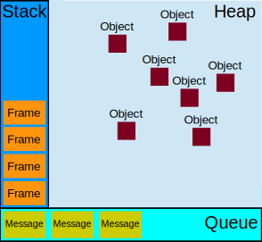

# Event Loop 事件循环

# 同步任务, 异步任务 (宏任务, 微任务)

- 同步任务: 代码从上到下顺序执行
- 异步任务: 分为宏任务和微任务
  - 宏任务: `<script>` 整体代码, setTimeout, setInterval, UI 事件, postMessage, AJAX
  - 微任务: Promise[.then, .catch, .finally], MutationObserver (监听 DOM 树的改变), process.nextTick (node 环境)

Promise 的构造函数是同步的 `new Promise((resolve, reject) => {/** 同步代码 */})`

## 运行机制



- 同步任务栈 Stack: 存放同步任务
- 异步任务队列 Queue: 先执行一个宏任务, 再执行当前宏任务的微任务, 进入下一个事件循环
  - 宏任务队列
  - 微任务队列

## 练习

```js
// 宏任务 0 (整体代码)
async function wtf() {
  console.log("Y");
  await Promise.resolve(); // 宏任务 0 的微任务 0
  console.log("X");
  // 等价于
  // Promise.resolve().then((/* value */) => console.log('X'))
}

setTimeout(() => {
  console.log(1);
  Promise.resolve().then((/* value */) => console.log(2)); // 宏任务 1 的微任务 5
}, 0); // 宏任务 1

setTimeout(() => {
  console.log(3);
  Promise.resolve().then(() => console.log(4)); // 宏任务 2 的微任务 6
}, 0); // 宏任务 2

Promise.resolve().then((/* value */) => console.log(5)); // 宏任务 0 的微任务 1
Promise.resolve().then((/* value */) => console.log(6)); // 宏任务 0 的微任务 2
Promise.resolve().then((/* value */) => console.log(7)); // 宏任务 0 的微任务 3
Promise.resolve().then((/* value */) => console.log(8)); // 宏任务 0 的微任务 4

wtf();
console.log(0);

// 宏任务队列: 宏任务 0,           宏任务 1,   宏任务 2
// 微任务队列: 微任务 1,2,3,4,0,   微任务 5,   微任务 6

// Y 0 5 6 7 8 X 1 2 3 4 (一共 3 轮事件循环)
```

## 浏览器在 1 帧中做了什么

对于 60fps 的屏幕, 1 帧是 1000/60 = 16.7ms, 浏览器在 1 帧中:

1. 处理用户事件: 例如 change, click, input 等
2. 执行定时器任务
3. 执行 requestAnimationFrame
4. 执行 DOM 的重绘 (有关颜色的..., 性能开销小) 和回流 (重排, 有关宽高的..., 性能开销大)
5. 其他, 如果有空闲时间, 则执行 requestIdleCallback (IDLE 期间可以懒加载 JS 脚本)
