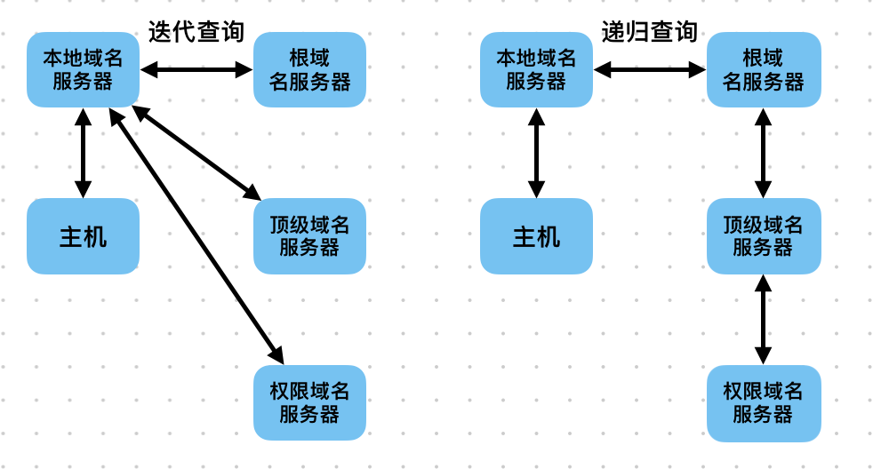

### OSI

- 应用层
  - 应用层 HTTP, FTP, DNS
  - 表示层 JPEG, Crypto, Decrypto
  - 会话层 SSL, TLS
- 传输层 TCP, UDP
- 网络层 IP, ICMP, ARP, RIP

### 三次握手

1. seq (sequence number) 序列号, 随机生成
2. ack (acknowledgement number) 确认号, ack = seq + 1
3. ACK ACK = 1 确认
4. SYN (synchronous) SYN 默认 0, SYN = 1 表示请求同步连接
5. FIN (finish) FIN 默认 0, FIN = 1 表示请求终止连接

```shell
client ~~~~~ handshake1 ~~~~> server
       ====> SYN1 = 1   ====> # C => S 请求同步
       ====> seq1       ====>

client <~~~~ handshake2 <~~~~~~~~~ server
       <==== ACK1 = 1        <==== # 确认 SYN1, C => S 同步
       <==== SYN2 = 1        <==== # S => C 请求同步
       <==== ack1 = seq1 + 1 <==== # 确认收到 seq1
       <==== seq2            <====

client ~~~~~ handshake3 ~~~~~~~~~> server
       ====> ACK2 = 1        ====> # 确认 SYN2, S => C 同步
       ====> ack2 = seq2 + 1 ====> # 确认收到 seq2
```

### 四次挥手

```shell
client ~~~~~ handshake1 ~~~~> server
       ====> FIN1 = 1   ====> # C => S 请求终止
       ====> seq1       ====>

FIN_WAIT_1

client <~~~~ handshake2 <~~~~~~~~~ server
       <==== ACK1 = 1        <==== # 第 1 次确认 FIN1
       <==== ack1 = seq1 + 1 <==== # 确认收到 seq1

FIN_WAIT_2 服务器发送剩余数据

client <~~~~ handshake3 <~~~~~~~~~ server
       <==== ACK1 = 1        <==== # 第 2 次确认 FIN1, C => S 终止
       <==== FIN2 = 1        <==== # S => C 请求终止
       <==== ack1 = seq1 + 1 <==== # 确认收到 seq1
       <==== seq2            <====

TIME_WAIT 客户端发送剩余数据, 持续 2MSL
# MSL, Maximum Segment Lifetime 最长报文段寿命, 大约 1~4 分钟

client ~~~~~ handshake4 ~~~~~~~~~> server
       ====> ACK2 = 1        ====> # 确认 FIN2, S => C 终止
       ====> ack2 = seq2 + 1 ====> # 确认收到 seq2
```

### URL

```txt
协议 ://域名           /目录名 /文件名
https://www.example.com/path/to/index.html
```

DNS 查询顺序

1. 浏览器 DNS 有没有? 有则 return
2. 操作系统 DNS 有没有? 有则 return
3. 本机 /etc/hosts 文件中有没有? 有则 return
4. 向域名服务器发送 DNS 查询请求


